# Data Sheet [ADF4351](http://www.analog.com/ADF4351)

**Rev. A [Document Feedback](https://form.analog.com/Form_Pages/feedback/documentfeedback.aspx?doc=ADF4351.pdf&product=ADF4351&rev=A) Information furnished by Analog Devices is believed to be accurate and reliable. However, no responsibility is assumed by Analog Devices for its use, nor for any infringements of patents or other rights of third parties that may result from its use. Specifications subject to change without notice. No license is granted by implication or otherwise under any patent or patent rights of Analog Devices. Trademarks and registered trademarks are the property of their respective owners.**

#### **FEATURES**

**Output frequency range: 35 MHz to 4400 MHz Fractional-N synthesizer and integer-N synthesizer Low phase noise VCO Programmable divide-by-1/-2/-4/-8/-16/-32/-64 output Typical jitter: 0.3 ps rms Typical EVM at 2.1 GHz: 0.4% Power supply: 3.0 V to 3.6 V Logic compatibility: 1.8 V Programmable dual-modulus prescaler of 4/5 or 8/9 Programmable output power level RF output mute function 3-wire serial interface Analog and digital lock detect Switched bandwidth fast lock mode Cycle slip reduction**

## **APPLICATIONS**

**Wireless infrastructure (W-CDMA, TD-SCDMA, WiMAX,**

**GSM, PCS, DCS, DECT) Test equipment**

**Wireless LANs, CATV equipment**

**Clock generation**

### **GENERAL DESCRIPTION**

Th[e ADF4351](http://www.analog.com/ADF4351) allows implementation of fractional-N or integer-N phase-locked loop (PLL) frequency synthesizers when used with an external loop filter and external reference frequency.

Th[e ADF4351](http://www.analog.com/ADF4351) has an integrated voltage controlled oscillator (VCO) with a fundamental output frequency ranging from 2200 MHz to 4400 MHz. In addition, divide-by-1/-2/-4/-8/-16/-32/-64 circuits allow the user to generate RF output frequencies as low as 35 MHz. For applications that require isolation, the RF output stage can be muted. The mute function is both pin- and software-controllable. An auxiliary RF output is also available, which can be powered down when not in use.

Control of all on-chip registers is through a simple 3-wire interface. The device operates with a power supply ranging from 3.0 V to 3.6 V and can be powered down when not in use.

### **FUNCTIONAL BLOCK DIAGRAM**

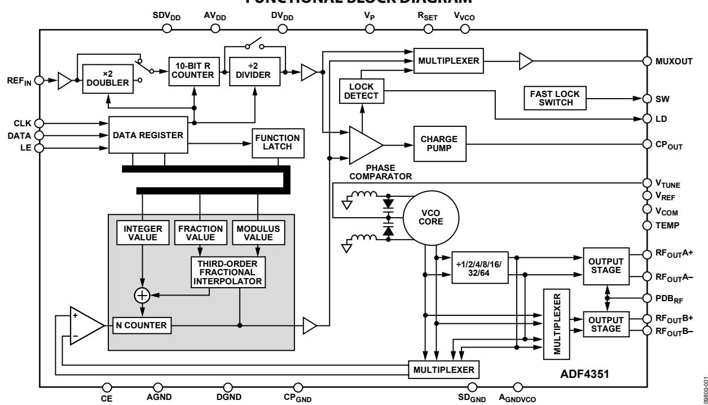

# TABLE OF CONTENTS

| Features.............................................................................................. | 1  |
|--------------------------------------------------------------------------------------------------------|----|
| Applications.......................................................................................    | 1  |
| General Description                                                                                    | 1  |
| Functional Block Diagram                                                                               | 1  |
| Revision History                                                                                       | 2  |
| Specifications.....................................................................................    | 3  |
| Timing Characteristics                                                                                 | 5  |
| Absolute Maximum Ratings............................................................                   | 6  |
| Transistor Count...........................................................................            | 6  |
| Thermal Resistance                                                                                     | 6  |
| ESD Caution..................................................................................          | 6  |
| Pin Configuration and Function Descriptions.............................                               | 7  |
| Typical Performance Characteristics                                                                    | 9  |
| Circuit Description.........................................................................           | 11 |
| Reference Input Section.............................................................                   | 11 |
| RF N Divider...............................................................................            | 11 |
| Phase Frequency Detector (PFD) and Charge Pump............                                             | 11 |
| MUXOUT and Lock Detect......................................................                           | 12 |
| Input Shift Registers...................................................................               | 12 |
| Program Modes                                                                                          | 12 |
| VCO..............................................................................................      | 12 |
| Output Stage................................................................................           | 13 |
| Register Maps..................................................................................        | 14 |
| Register 0                                                                                             | 18 |

| Register 1                                                                                  | 18 |
|---------------------------------------------------------------------------------------------|----|
| Register 2                                                                                  | 18 |
| Register 3                                                                                  | 19 |
| Register 4                                                                                  | 20 |
| Register 5                                                                                  | 20 |
| Register Initialization Sequence                                                            | 20 |
| RF Synthesizer—A Worked Example                                                             | 21 |
| Reference Doubler and Reference Divider                                                     | 21 |
| 12-Bit Programmable Modulus................................................                 | 21 |
| Cycle Slip Reduction for Faster Lock Times...........................                       | 22 |
| Spurious Optimization and Fast Lock.....................................                    | 22 |
| Fast Lock Timer and Register Sequences................................                      | 22 |
| Fast Lock Example                                                                           | 22 |
| Fast Lock Loop Filter Topology................................................              | 23 |
| Spur Mechanisms.......................................................................      | 23 |
| Spur Consistency and Fractional Spur Optimization                                           | 24 |
| Phase Resync............................................................................... | 24 |
| Applications Information                                                                    | 25 |
| Direct Conversion Modulator..................................................               | 25 |
| Interfacing to the ADuC70xx and the ADSP-BF527.............                                 | 26 |
| PCB Design Guidelines for a Chip Scale Package                                              | 26 |
| Output Matching........................................................................     | 27 |
| Outline Dimensions.......................................................................   | 28 |
| Ordering Guide                                                                              | 28 |

### **REVISION HISTORY**

| 1/2017—Rev. 0 to Rev. A                                                            |                                                  |
|------------------------------------------------------------------------------------|--------------------------------------------------|
| Changed CP-32-2 to CP-32-7                                                         | ......................................Throughout |
| Change to Figure 3                                                                 | 7                                                |
| Updated Outline Dimension......................................................... | 28                                               |
| Changes to Ordering Guide                                                          | 28                                               |

### **5/2012—Revision 0: Initial Version**

# SPECIFICATIONS

AVDD = DVDD = VVCO = SDVDD = VP = 3.3 V ± 10%; AGND = DGND = 0 V; TA = TMIN to TMAX, unless otherwise noted. Operating temperature range is −40°C to +85°C.

| Table 1.                                       |            |         |      |       |                                                   |
|------------------------------------------------|------------|---------|------|-------|---------------------------------------------------|
| Parameter                                      | Min        | Typ     | Max  | Unit  | Test Conditions/Comments                          |
| REFIN CHARACTERISTICS                          |            |         |      |       |                                                   |
| Input Frequency                                | 10         |         | 250  | MHz   | For f < 10 MHz, ensure slew rate > 21 V/µs        |
| Input Sensitivity                              | 0.7        |         | AVDD | V p-p | Biased at AVDD/2; ac coupling ensures AVDD/2 bias |
| Input Capacitance                              |            | 10      |      | pF    |                                                   |
| Input Current                                  |            |         | ±60  | µA    |                                                   |
| PHASE FREQUENCY DETECTOR                       | (PFD)      |         |      |       |                                                   |
| Phase Detector Frequency                       |            |         | 32   | MHz   | Fractional-N                                      |
|                                                |            |         | 45   | MHz   | Integer-N (band select enabled)                   |
| CHARGE PUMP                                    |            |         | 90   | MHz   | Integer-N (band select disabled)                  |
| ICP Sink/Source 1                              |            |         |      |       | RSET = 5.1 kΩ                                     |
| High Value                                     |            | 5       |      | mA    |                                                   |
| Low Value                                      |            | 0.312   |      | mA    |                                                   |
| RSET Range                                     | 3.9        |         | 10   | kΩ    |                                                   |
| Sink and Source Current Matching               |            | 2       |      | %     | 0.5 V ≤ VCP ≤ 2.5 V                               |
| ICP vs. VCP                                    |            | 1.5     |      | %     | 0.5 V ≤ VCP ≤ 2.5 V                               |
| ICP vs. Temperature LOGIC INPUTS               |            | 2       |      | %     | VCP = 2.0 V                                       |
| Input High Voltage, VINH                       | 1.5        |         |      | V     |                                                   |
| Input Low Voltage, VINL                        |            |         | 0.6  | V     |                                                   |
| Input Current, IINH/IINL                       |            |         | ±1   | µA    |                                                   |
| Input Capacitance, CIN LOGIC OUTPUTS           |            | 3.0     |      | pF    |                                                   |
| Output High Voltage, VOH                       | DVDD − 0.4 |         |      | V     | CMOS output selected                              |
| Output High Current, IOH                       |            |         | 500  | µA    |                                                   |
| Output Low Voltage, VOL POWER SUPPLIES         |            |         | 0.4  | V     | IOL = 500 µA                                      |
| AVDD                                           | 3.0        |         | 3.6  | V     |                                                   |
| DVDD, VVCO, SDVDD, VP                          |            | AVDD    |      |       | These voltages must equal AVDD                    |
| DIDD + AID D2                                  |            | 21      | 27   | mA    |                                                   |
| Output Dividers                                |            | 6 to 36 |      | mA    | Each output divide-by-2 consumes 6 mA             |
| IVC O2                                         |            | 70      | 80   | mA    |                                                   |
| IRFO UT2                                       |            | 21      | 26   | mA    | RF output stage is programmable                   |
| Low Power Sleep Mode RF OUTPUT CHARACTERISTICS |            | 7       | 10   | µA    |                                                   |
| VCO Output Frequency                           | 2200       |         | 4400 | MHz   | Fundamental VCO mode                              |
|                                                | 34.375     |         |      | MHz   | 2200 MHz fundamental output and                   |
| Using Dividers                                 |            |         |      |       | divide-by-64 selected                             |
| VCO Sensitivity, KV                            |            | 40      |      | MHz/V |                                                   |
| Frequency Pushing (Open-Loop)                  |            | 1       |      | MHz/V |                                                   |
| Frequency Pulling (Open-Loop)                  |            | 90      |      | kHz   | Into 2.00 VSWR load                               |
| Harmonic Content (Second)                      |            | −19     |      | dBc   | Fundamental VCO output                            |
|                                                |            | −20     |      | dBc   | Divided VCO output                                |
| Harmonic Content (Third)                       |            | −13     |      | dBc   | Fundamental VCO output                            |
|                                                |            | −10     |      | dBc   | Divided VCO output                                |

| Parameter                            | Min Typ Max | Unit   | Test Conditions/Comments                      |
|--------------------------------------|-------------|--------|-----------------------------------------------|
| Minimum RF Output Power3             | −4          | dBm    | Programmable in 3 dB steps                    |
| Maximum RF Output Power3             | 5           | dBm    |                                               |
| Output Power Variation               | ±1          | dB     |                                               |
| Minimum VCO Tuning Voltage           | 0.5         | V      |                                               |
| Maximum VCO Tuning Voltage           | 2.5         | V      |                                               |
| VCO Phase Noise Performance          |             |        | VCO noise is measured in open-loop conditions |
|                                      | −89         | dBc/Hz | 10 kHz offset from 2.2 GHz carrier            |
|                                      | −114        | dBc/Hz | 100 kHz offset from 2.2 GHz carrier           |
|                                      | −134        | dBc/Hz | 1 MHz offset from 2.2 GHz carrier             |
|                                      | −148        | dBc/Hz | 5 MHz offset from 2.2 GHz carrier             |
|                                      | −86         | dBc/Hz | 10 kHz offset from 3.3 GHz carrier            |
|                                      | −111        | dBc/Hz | 100 kHz offset from 3.3 GHz carrier           |
|                                      | −134        | dBc/Hz | 1 MHz offset from 3.3 GHz carrier             |
|                                      | −145        | dBc/Hz | 5 MHz offset from 3.3 GHz carrier             |
|                                      | −83         | dBc/Hz | 10 kHz offset from 4.4 GHz carrier            |
|                                      | −110        | dBc/Hz | 100 kHz offset from 4.4 GHz carrier           |
|                                      | −131        | dBc/Hz | 1 MHz offset from 4.4 GHz carrier             |
|                                      | −145        | dBc/Hz | 5 MHz offset from 4.4 GHz carrier             |
|                                      |             |        | PLL loop BW = 500 kHz                         |
|                                      | −220        | dBc/Hz | ABP = 6 ns                                    |
|                                      | −221        | dBc/Hz | ABP = 3 ns                                    |
| 5                                    |             |        | 10 kHz offset; normalized to 1 GHz            |
|                                      | −116        | dBc/Hz | ABP = 6 ns                                    |
|                                      | −118        | dBc/Hz | ABP = 3 ns                                    |
| In-Band Phase Noise                  | −100        | dBc/Hz | 3 kHz from 2111.28 MHz carrier                |
| Integrated RMS Jitter6               | 0.27        | ps     |                                               |
|                                      | −80         | dBc    |                                               |
| Level of Signal with RF Mute Enabled | −40         | dBm    |                                               |

1 ICP is internally modified to maintain constant loop gain over the frequency range.

2

TA = 25°C; AVDD = DVDD = VVCO = 3.3 V; prescaler = 8/9; fREFIN = 100 MHz; fPFD = 25 MHz; fRF = 4.4 GHz. 3 Using 50 Ω resistors to VVCO, into a 50 Ω load. Power measured with auxiliary RF output disabled. The current consumption of the auxiliary output is the same as for the main output.

4 The synthesizer phase noise floor is estimated by measuring the in-band phase noise at the output of the VCO and subtracting 20 log N (where N is the N divider

value) and 10 log fPFD. To calculate in-band phase noise performance as seen at the VCO output, use the following formula: *PNSYNTH* =*PNTOT* − 10 log(*fPFD*) − 20 log *N*. 5 The PLL phase noise is composed of flicker (1/f) noise plus the normalized PLL noise floor. The formula for calculating the 1/f noise contribution at an RF frequency (fRF) and at a frequency offset (f) is given by *PN* =*PN1\_f* + 10 log(10 kHz/*f*) + 20 log(*fRF*/1GHz). Both the normalized phase noise floor and flicker noise are modeled i[n ADIsimPLL.](http://www.analog.com/ADIsimPLL) 6 fREFIN = 122.88 MHz; fPFD = 30.72 MHz; VCO frequency = 4222.56 MHz; RFOUT = 2111.28 MHz; N = 137; loop BW = 60 kHz; ICP = 2.5 mA; low noise mode. The noise was

measured with an EVAL-ADF4351EB1Z and the Rohde & Schwarz FSUP signal source analyzer.

### **TIMING CHARACTERISTICS**

AVDD = DVDD = VVCO = SDVDD = VP = 3.3 V ± 10%; AGND = DGND = 0 V; 1.8 V and 3 V logic levels used; TA = TMIN to TMAX, unless otherwise noted.

#### **Table 2.**

| Parameter | Limit | Unit   | Description            |
|-----------|-------|--------|------------------------|
| t1        | 20    | ns min | LE setup time          |
| t2        | 10    | ns min | DATA to CLK setup time |
| t3        | 10    | ns min | DATA to CLK hold time  |
| t4        | 25    | ns min | CLK high duration      |
| t5        | 25    | ns min | CLK low duration       |
| t6        | 10    | ns min | CLK to LE setup time   |
| t7        | 20    | ns min | LE pulse width         |

#### **Timing Diagram**

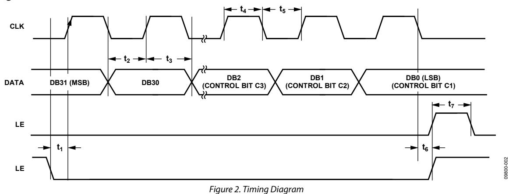

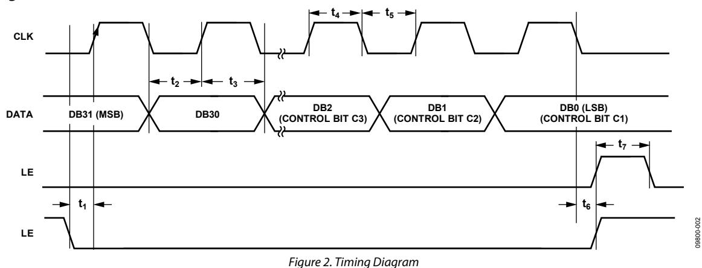

# ABSOLUTE MAXIMUM RATINGS

TA = 25°C, unless otherwise noted.

#### **Table 3.**

| Parameter                    | Rating                |
|------------------------------|-----------------------|
| AVDD to GND1                 | −0.3 V to +3.9 V      |
| AVDD to DVDD                 | −0.3 V to +0.3 V      |
| VVCO to GND1                 | −0.3 V to +3.9 V      |
| VVCO to AVDD                 | −0.3 V to +0.3 V      |
| Digital I/O Voltage to GND1  | −0.3 V to VDD + 0.3 V |
| Analog I/O Voltage to GND1   | −0.3 V to VDD + 0.3 V |
| REFIN to GND1                | −0.3 V to VDD + 0.3 V |
| Operating Temperature Range  | −40°C to +85°C        |
| Storage Temperature Range    | −65°C to +125°C       |
| Maximum Junction Temperature | 150°C                 |
| Peak Temperature             | 260°C                 |
| Time at Peak Temperature     | 40 sec                |

1 GND = AGND = DGND = CPGND = SDGND = AGNDVCO = 0 V.

Stresses at or above those listed under Absolute Maximum Ratings may cause permanent damage to the product. This is a stress rating only; functional operation of the product at these or any other conditions above those indicated in the operational section of this specification is not implied. Operation beyond the maximum operating conditions for extended periods may affect product reliability.

This device is a high performance RF integrated circuit with an ESD rating of <1.5 kV and is ESD sensitive. Proper precautions should be taken for handling and assembly.

## **TRANSISTOR COUNT**

The transistor count for th[e ADF4351](http://www.analog.com/ADF4351) is 36,955 (CMOS) and 986 (bipolar).

### **THERMAL RESISTANCE**

Thermal impedance (θJA) is specified for a device with the exposed pad soldered to GND.

#### **Table 4. Thermal Resistance**

| Package Type            | $\theta_{JA}$ | Unit |
|-------------------------|---------------|------|
| 32-Lead LFCSP (CP-32-7) | 27.3          | °C/W |

## **ESD CAUTION**

**ESD (electrostatic discharge) sensitive device.** Charged devices and circuit boards can discharge without detection. Although this product features patented or proprietary protection circuitry, damage may occur on devices subjected to high energy ESD. Therefore, proper ESD precautions should be taken to avoid performance degradation or loss of functionality.

# PIN CONFIGURATION AND FUNCTION DESCRIPTIONS

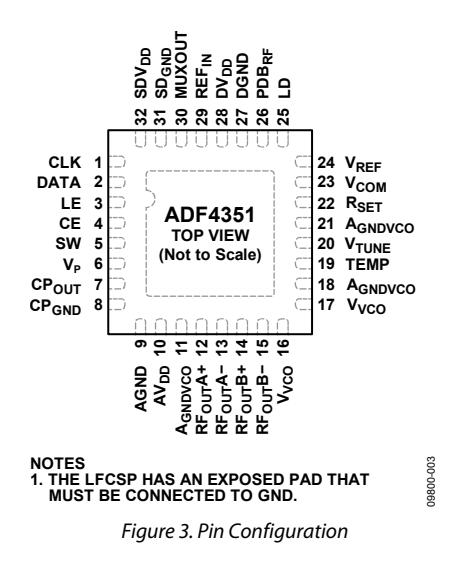

**Table 5. Pin Function Descriptions**

| Pin No.    | Mnemonic | Description                                                                                                          |
|------------|----------|----------------------------------------------------------------------------------------------------------------------|
| 1          | CLK      | Serial Clock Input. Data is clocked into the 32-bit shift register on the CLK rising edge. This input is a high      |
| 2          | DATA     | Serial Data Input. The serial data is loaded MSB first with the three LSBs as the control bits. This input is a high |
| 3          | LE       | Load Enable. When LE goes high, the data stored in the 32-bit shift register is loaded into the register that is     |
|            |          | selected by the three control bits. This input is a high impedance CMOS input.                                       |
| 4          | CE       | Chip Enable. A logic low on this pin powers down the device and puts the charge pump into three-state mode.          |
|            |          | A logic high on this pin powers up the device, depending on the status of the power-down bits.                       |
| 5          | SW       | Fast Lock Switch. A connection should be made from the loop filter to this pin when using the fast lock mode.        |
| 6          | VP       | Charge Pump Power Supply. VP must have the same value as AVDD. Place decoupling capacitors to the ground             |
|            |          | plane as close to this pin as possible.                                                                              |
| 7          | CPOUT    | Charge Pump Output. When enabled, this output provides ±ICP to the external loop filter. The output of the           |
|            |          | loop filter is connected to VTUNE to drive the internal VCO.                                                         |
| 8          | CPGND    | Charge Pump Ground. This output is the ground return pin for CPOUT.                                                  |
| 9          | AGND     | Analog Ground. Ground return pin for AVDD.                                                                           |
| 10         | AVDD     | Analog Power Supply. This pin ranges from 3.0 V to 3.6 V. Place decoupling capacitors to the analog ground           |
|            |          | plane as close to this pin as possible. AVDD must have the same value as DVDD.                                       |
| 11, 18, 21 | AGNDVCO  | VCO Analog Ground. Ground return pins for the VCO.                                                                   |
| 12         | RFOUTA+  | VCO Output. The output level is programmable. The VCO fundamental output or a divided-down version is                |
| 13         | RFOUTA−  | Complementary VCO Output. The output level is programmable. The VCO fundamental output or a divided                 |
|            |          | down version is available.                                                                                           |
| 14         | RFOUTB+  | Auxiliary VCO Output. The output level is programmable. The VCO fundamental output or a divided-down                 |
| 15         | RFOUTB−  | Complementary Auxiliary VCO Output. The output level is programmable. The VCO fundamental output or a                |
| 16, 17     | VVCO     | Power Supply for the VCO. This pin ranges from 3.0 V to 3.6 V. Place decoupling capacitors to the analog             |
|            |          | ground plane as close to these pins as possible. VVCO must have the same value as AVDD.                              |
| 19         | TEMP     | Temperature Compensation Output. Place decoupling capacitors to the ground plane as close to this pin as             |
| 20         | VTUNE    | Control Input to the VCO. This voltage determines the output frequency and is derived from filtering the CPOUT       |

| Pin No. | Mnemonic    | Description                                                                                               |                                                                                        |
|---------|-------------|-----------------------------------------------------------------------------------------------------------|----------------------------------------------------------------------------------------|
| 22      | RSET        | Connecting a resistor between this pin and ground                                                         | sets the charge pump output current. The nominal voltage                               |
|         |             | bias at the RSET pin is 0.55 V. The relationship between ICP                                              | and RSET is as follows:                                                                |
|         |             | ICP = 25.5/ RSET                                                                                          |                                                                                        |
|         |             | RSET = 5.1 kΩ.                                                                                            |                                                                                        |
|         |             | ICP = 5 mA.                                                                                               |                                                                                        |
| 23      | VCOM        | Internal Compensation Node.                                                                               | Biased at half the tuning range. Place decoupling capacitors to the ground plane       |
| 24      | VREF        | Reference Voltage. Place decoupling capacitors to the ground plane as close                               | to this pin as possible.                                                               |
| 25      | LD          | Lock Detect Output Pin. A                                                                                 | logic high output on this pin indicates PLL lock. A logic low output indicates loss    |
| 26      | PDBRF       | RF Power-Down. A logic low on this pin mutes the RF outputs. This function is also software controllable. |                                                                                        |
| 27      | DGND        | Digital Ground. Ground return pin                                                                         | for DVDD.                                                                              |
| 28      | DVDD        | Digital Power Supply. DVDD                                                                                | must have the same value as AVDD. Place decoupling capacitors to the ground            |
| 29      | REFIN       | Reference Input. This CMOS input has                                                                      | a nominal threshold of AVDD/2 and a dc equivalent input resistance of                  |
|         |             | 100 kΩ. This input can be driven from a TTL or CMOS crystal oscillator,                                   | or it can be ac-coupled.                                                               |
| 30      | MUXOUT      | Multiplexer Output. The                                                                                   | multiplexer output allows the lock detect value, the N divider value, or the R counter |
| 31      | SDGND       | Digital Σ-Δ Modulator Ground. Ground return pin for the Σ-Δ                                               | modulator.                                                                             |
| 32      | SDVDD       | Power Supply Pin for the Digital Σ-Δ                                                                      | Modulator. SDVDD must have the same value as AVDD. Place decoupling                    |
|         |             | capacitors to the ground plane as close to this pin                                                       | as possible.                                                                           |
| EP      | Exposed Pad | Exposed Pad. The LFCSP has an exposed pad that must be connected to GND.                                  |                                                                                        |

## TYPICAL PERFORMANCE CHARACTERISTICS

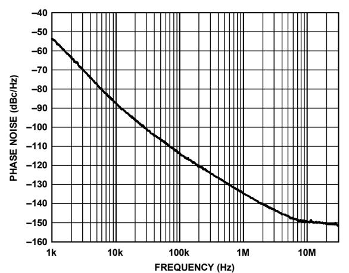

09800-104

Figure 4. Open-Loop VCO Phase Noise, 2.2 GHz

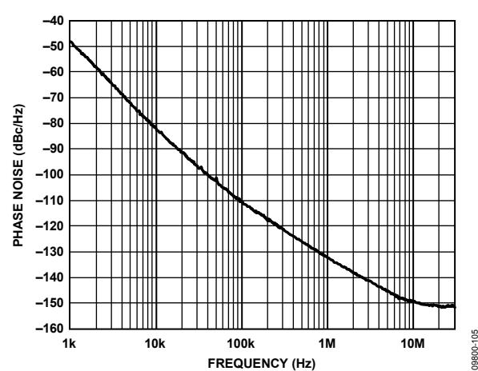

Figure 5. Open-Loop VCO Phase Noise, 3.3 GHz

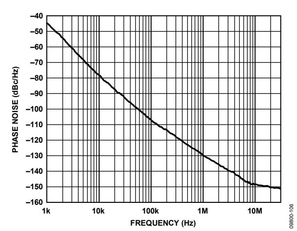

Figure 6. Open-Loop VCO Phase Noise, 4.4 GHz

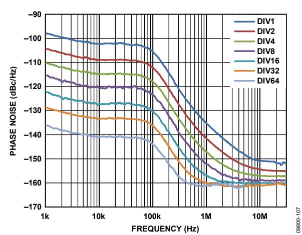

Figure 7. Closed-Loop Phase Noise, Fundamental VCO and Dividers, VCO = 2.2 GHz, PFD = 25 MHz, Loop Filter Bandwidth = 63 kHz

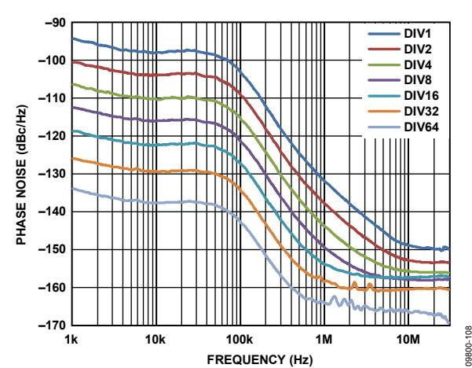

Figure 8. Closed-Loop Phase Noise, Fundamental VCO and Dividers, VCO = 3.3 GHz, PFD = 25 MHz, Loop Filter Bandwidth = 63 kHz

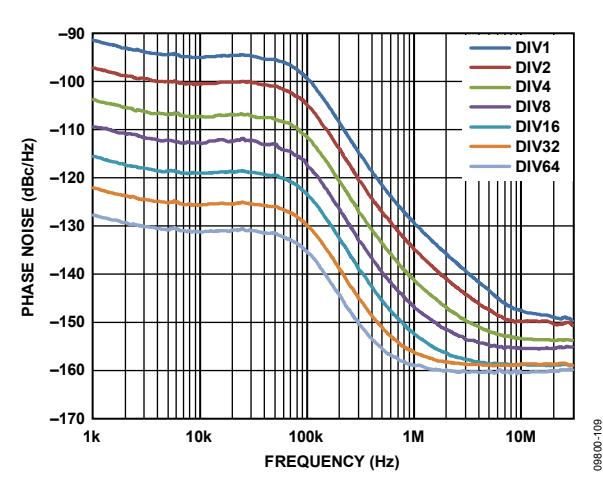

Figure 9. Closed-Loop Phase Noise, Fundamental VCO and Dividers, VCO = 4.4 GHz, PFD = 25 MHz, Loop Filter Bandwidth = 63 kHz

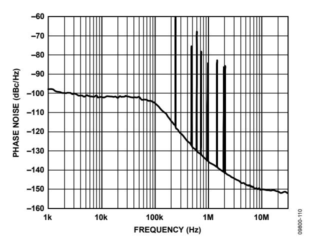

*Figure 10. Fractional-N Spur Performance, Low Noise Mode, W-CDMA Band; RFOUT= 2111.28 MHz, REFIN = 122.88 MHz, PFD= 30.72 MHz, Output Divide-by-2 Selected; Loop Filter Bandwidth = 60 kHz, Channel Spacing = 240 kHz; RMS Phase Error = 0.21°, RMS Jitter = 0.27 ps, EVM = 0.37%*

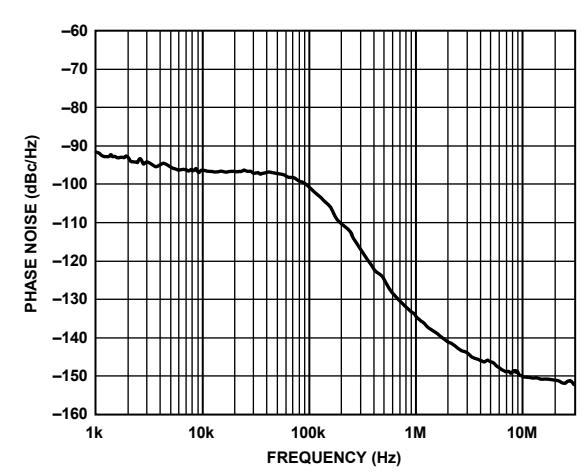

09800-111

*Figure 11. Fractional-N Spur Performance, Low Spur Mode, W-CDMA Band; RFOUT= 2111.28 MHz, REFIN = 122.88 MHz, PFD= 30.72 MHz, Output Divide-by-2 Selected; Loop Filter Bandwidth = 60 kHz, Channel Spacing = 240 kHz; RMS Phase Error = 0.37°, RMS Jitter = 0.49 ps, EVM = 0.64%*

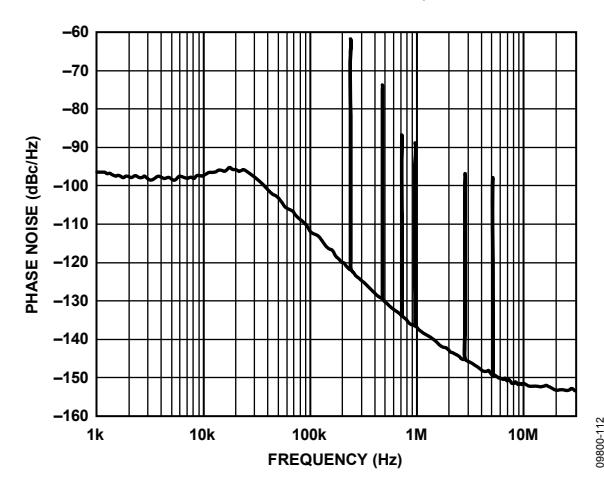

*Figure 12. Fractional-N Spur Performance, Low Noise Mode, W-CDMA Band; RFOUT= 2111.28 MHz, REFIN = 122.88 MHz, PFD= 30.72 MHz, Output Divide-by-2 Selected; Loop Filter Bandwidth = 20 kHz, Channel Spacing = 240 kHz; RMS Phase Error = 0.25°, RMS Jitter = 0.32 ps, EVM = 0.44%*

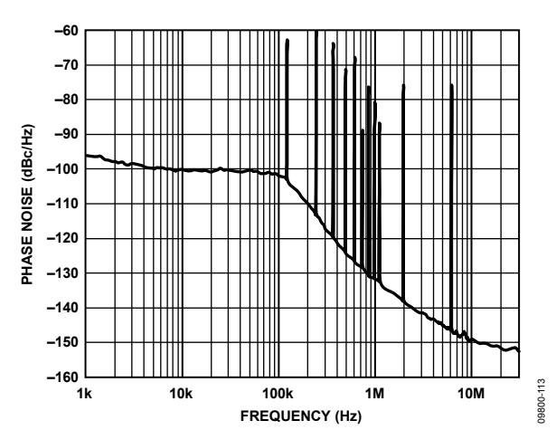

*Figure 13. Fractional-N Spur Performance, Low Noise Mode, LTE Band; RFOUT = 2646.96 MHz, REFIN = 122.88 MHz, PFD = 30.72 MHz; Loop Filter Bandwidth = 60 kHz, Channel Spacing = 240 kHz; Phase Word = 9, RMS Phase Error = 0.28°, RMS Jitter = 0.29 ps, EVM = 0.49%*

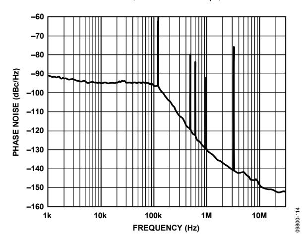

*Figure 14. Fractional-N Spur Performance, Low Spur Mode, LTE Band; RFOUT = 2646.96 MHz, REFIN = 122.88 MHz, PFD = 30.72 MHz; Loop Filter Bandwidth = 60 kHz, Channel Spacing = 240 kHz; RMS Phase Error = 0.56°, RMS Jitter = 0.59 ps, EVM = 0.98%*

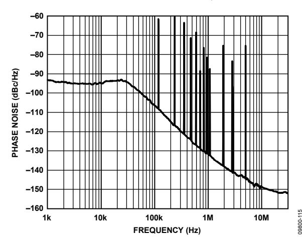

*Figure 15. Fractional-N Spur Performance, Low Noise Mode, W-CDMA Band; RFOUT = 2646.96 MHz, REFIN = 122.88 MHz, PFD = 30.72 MHz; Loop Filter Bandwidth = 20 kHz, Channel Spacing = 240 kHz; RMS Phase Error = 0.35°, RMS Jitter = 0.36 ps, EVM = 0.61%*

## CIRCUIT DESCRIPTION **REFERENCE INPUT SECTION**

The reference input stage is shown i[n Figure 16.](#page-10-4) The SW1 and SW2 switches are normally closed. The SW3 switch is normally open. When power-down is initiated, SW3 is closed, and SW1 and SW2 are opened. In this way, no loading of the REFIN pin occurs during power-down.

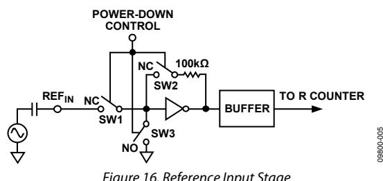

Figure 16. Reference Input Stage

### **RF N DIVIDER**

The RF N divider allows a division ratio in the PLL feedback path. The division ratio is determined by the INT, FRAC, and MOD values, which build up this divider (se[e Figure 17\)](#page-10-5).

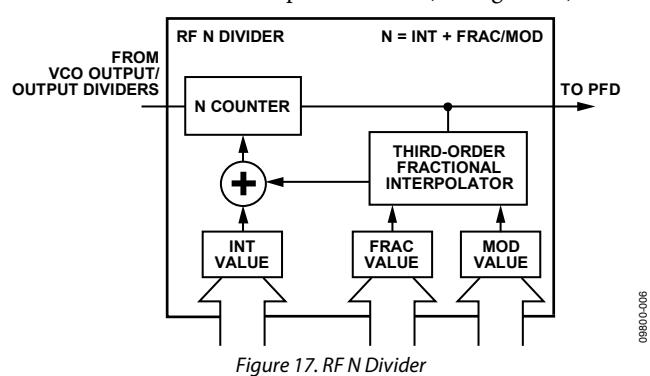

#### **INT, FRAC, MOD, and R Counter Relationship**

The INT, FRAC, and MOD values, in conjunction with the R counter, make it possible to generate output frequencies that are spaced by fractions of the PFD frequency. For more information, see the [RF Synthesizer—A Worked Example s](#page-20-0)ection.

The RF VCO frequency (RFOUT) equation is

| $R_{OUT} = f_{PFD} \times (INT + (FRAC/MOD))$ | (1) |
|-----------------------------------------------|-----|
|-----------------------------------------------|-----|

where:

*RFOUT* is the output frequency of the voltage controlled oscillator (VCO).

*INT* is the preset divide ratio of the binary 16-bit counter (23 to 65,535 for the 4/5 prescaler; 75 to 65,535 for the 8/9 prescaler). *FRAC* is the numerator of the fractional division (0 to MOD − 1). *MOD* is the preset fractional modulus (2 to 4095).

The PFD frequency (fPFD) equation is

$$f_{PED} = REF_{IN} \times [(1 + D)/(R \times (1 + T))] \quad (2)$$

where:

*REFIN* is the reference input frequency.

*D* is the REFIN doubler bit (0 or 1).

*R* is the preset divide ratio of the binary 10-bit programmable reference counter (1 to 1023).

*T* is the REFIN divide-by-2 bit (0 or 1).

#### **Integer-N Mode**

If FRAC = 0 and the DB8 (LDF) bit in Register 2 is set to 1, the synthesizer operates in integer-N mode. The DB8 bit in Register 2 should be set to 1 for integer-N digital lock detect.

#### **R Counter**

The 10-bit R counter allows the input reference frequency (REFIN) to be divided down to produce the reference clock to the PFD. Division ratios from 1 to 1023 are allowed.

#### **PHASE FREQUENCY DETECTOR (PFD) AND CHARGE PUMP**

The phase frequency detector (PFD) takes inputs from the R counter and N counter and produces an output proportional to the phase and frequency difference between them[. Figure 18](#page-10-6)  is a simplified schematic of the phase frequency detector.

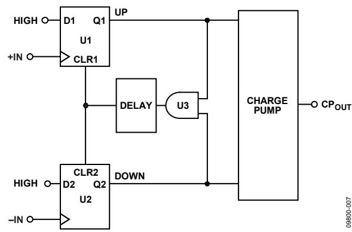

Figure 18. PFD Simplified Schematic

The PFD includes a programmable delay element that sets the width of the antibacklash pulse (ABP). This pulse ensures that there is no dead zone in the PFD transfer function. Bit DB22 in Register 3 (R3) is used to set the ABP as follows:

 When Bit DB22 is set to 0, the ABP width is programmed to 6 ns, the recommended value for fractional-N applications. When Bit DB22 is set to 1, the ABP width is programmed to 3 ns, the recommended value for integer-N applications.

For integer-N applications, the in-band phase noise is improved by enabling the shorter pulse width. The PFD frequency can operate up to 90 MHz in this mode. To operate with PFD frequencies higher than 45 MHz, VCO band select must be disabled by setting the phase adjust bit (DB28) to 1 in Register 1.

### **MUXOUT AND LOCK DETECT**

The multiplexer output on th[e ADF4351](http://www.analog.com/ADF4351) allows the user to access various internal points on the chip. The state of MUXOUT is controlled by the M3, M2, and M1 bits in Register 2 (se[e Figure 26\)](#page-15-0). [Figure 19](#page-11-4) shows the MUXOUT section in block diagram form.

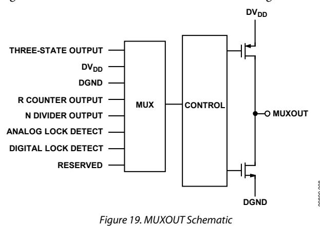

### **INPUT SHIFT REGISTERS**

The [ADF4351](http://www.analog.com/ADF4351) digital section includes a 10-bit RF R counter, a 16-bit RF N counter, a 12-bit FRAC counter, and a 12-bit modulus counter. Data is clocked into the 32-bit shift register on each rising edge of CLK. The data is clocked in MSB first. Data is transferred from the shift register to one of six latches on the rising edge of LE. The destination latch is determined by the state of the three control bits (C3, C2, and C1) in the shift register. As shown in [Figure 2,](#page-4-1) the control bits are the three LSBs: DB2, DB1, and DB0[. Table 6](#page-11-5) shows the truth table for these bits. [Figure 23](#page-13-1) summarizes how the latches are programmed.

**Table 6. Truth Table for the C3, C2, and C1 Control Bits**

| C3 | Control Bits C2 | C1 | Register        |
|----|-----------------|----|-----------------|
| 0  | 0               | 0  | Register 0 (R0) |
| 0  | 0               | 1  | Register 1 (R1) |
| 0  | 1               | 0  | Register 2 (R2) |
| 0  | 1               | 1  | Register 3 (R3) |
| 1  | 0               | 0  | Register 4 (R4) |
| 1  | 0               | 1  | Register 5 (R5) |

### **PROGRAM MODES**

[Table 6](#page-11-5) an[d Figure 23](#page-13-1) throug[h Figure 29](#page-16-0) show how the program modes are set up in the [ADF4351.](http://www.analog.com/ADF4351)

The following settings in th[e ADF4351](http://www.analog.com/ADF4351) are double buffered: phase value, modulus value, reference doubler, reference divide-by-2, R counter value, and charge pump current setting. Before the part uses a new value for any double-buffered setting, the following two events must occur:

- 1. The new value is latched into the device by writing to the appropriate register.
- 2. A new write is performed on Register 0 (R0).

For example, any time that the modulus value is updated, Register 0 (R0) must be written to, to ensure that the modulus value is loaded correctly. The divider select value in Register 4 (R4) is also double buffered, but only if the DB13 bit of Register 2 (R2) is set to 1.

### **VCO**

The VCO core in th[e ADF4351](http://www.analog.com/ADF4351) consists of three separate VCOs, each of which uses 16 overlapping bands, as shown i[n Figure 20,](#page-11-6) to allow a wide frequency range to be covered without a large VCO sensitivity (KV) and resultant poor phase noise and spurious performance.

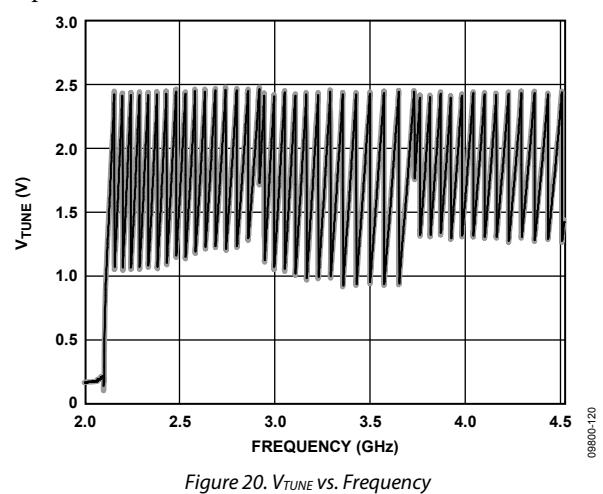

The correct VCO and band are selected automatically by the VCO and band select logic at power-up or whenever Register 0 (R0) is updated.

VCO and band selection take 10 PFD cycles multiplied by the value of the band select clock divider. The VCO VTUNE is disconnected from the output of the loop filter and is connected to an internal reference voltage.

The R counter output is used as the clock for the band select logic. A programmable divider is provided at the R counter output to allow division by an integer from 1 to 255; the divider value is set using Bits[DB19:DB12] in Register 4 (R4). When the required PFD frequency is higher than 125 kHz, the divide ratio should be set to allow enough time for correct band selection.

Band selection takes 10 cycles of the PFD frequency, equal to 80 µs. If faster lock times are required, Bit DB23 in Register 3 (R3) must be set to 1. This setting allows the user to select a higher band select clock frequency of up to 500 kHz, which speeds up the minimum band select time to 20 µs. For phase adjustments and small (<1 MHz) frequency adjustments, the user can disable VCO band selection by setting Bit DB28 in Register 1 (R1) to 1. This setting selects the phase adjust feature.

After band selection, normal PLL action resumes. The nominal value of KV is 40 MHz/V when the N divider is driven from the VCO output or from this value divided by D. D is the output divider value if the N divider is driven from the RF divider output (selected by programming Bits[DB22:DB20] in Register 4). The [ADF4351](http://www.analog.com/ADF4351) contains linearization circuitry to minimize any variation of the product of ICP and KV to keep the loop bandwidth constant.

The VCO shows variation of KV as the VTUNE varies within the band and from band to band. For wideband applications covering a wide frequency range (and changing output dividers), a value of 40 MHz/V provides the most accurate KV because this value is closest to an average value[. Figure 21](#page-12-1) shows how KV varies with fundamental VCO frequency, along with an average value for the frequency band. Users may prefer this figure when using narrow-band designs.

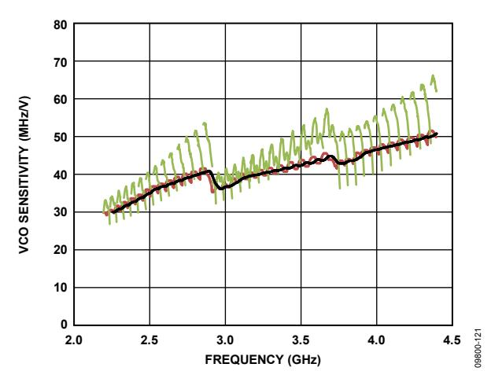

*Figure 21. VCO Sensitivity (KV) vs. Frequency*

### **OUTPUT STAGE**

The RFOUTA+ and RFOUTA− pins of the [ADF4351](http://www.analog.com/ADF4351) are connected to the collectors of an NPN differential pair driven by buffered outputs of the VCO, as shown i[n Figure 22.](#page-12-2) 

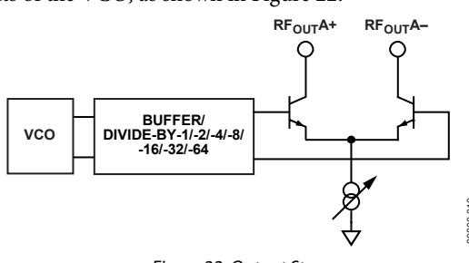

*Figure 22. Output Stage*

To allow the user to optimize the power dissipation vs. the output power requirements, the tail current of the differential pair is programmable using Bits[DB4:DB3] in Register 4 (R4). Four current levels can be set. These levels give output power levels of −4 dBm, −1 dBm, +2 dBm, and +5 dBm, using a 50 Ω resistor to AVDD and ac coupling into a 50 Ω load. Alternatively, both outputs can be combined in a 1 + 1:1 transformer or a 180° microstrip coupler (see the [Output Matching](#page-26-0) section).

If the outputs are used individually, the optimum output stage consists of a shunt inductor to VVCO. The unused complementary output must be terminated with a similar circuit to the used output.

An auxiliary output stage exists on the RFOUTB+ and RFOUTB− pins, providing a second set of differential outputs that can be used to drive another circuit. The auxiliary output stage can be used only if the primary outputs are enabled. If the auxiliary output stage is not used, it can be powered down.

Another feature of the [ADF4351](http://www.analog.com/ADF4351) is that the supply current to the RF output stage can be shut down until the part achieves lock, as measured by the digital lock detect circuitry. This feature is enabled by setting the mute till lock detect (MTLD) bit in Register 4 (R4).

## REGISTER MAPS

| RESERVED |      |      |      |      |                                         |                |      |           |                                |     |     |     |                   |
|----------|------|------|------|------|-----------------------------------------|----------------|------|-----------|--------------------------------|-----|-----|-----|-------------------|
| DB31     | DB30 | DB29 | DB28 | DB27 | DB26 DB25 DB24 DB23 DB22 DB21 DB20 DB19 | DB18 DB17 DB16 | DB15 | DB14 DB13 | DB12 DB11 DB10 DB9 DB8 DB7 DB6 | DB5 | DB4 | DB3 | DB2 DB1 DB0       |
| 0        | N16  | N15  | N14  | N13  | N12 N11 N10 N9                          |                |      |           |                                |     |     |     |                   |
|          |      |      |      |      | 16-BIT INTEGER VALUE (INT)              |                |      |           | 12-BIT FRACTIONAL VALUE (FRAC) |     |     |     | CONTROL BITS      |
|          |      |      |      |      | N8 N7 N6 N5                             | N4 N3 N2       | N1   | F12 F11   | F10 F9 F8 F7 F6 F5 F4          | F3  | F2  | F1  | C3(0) C2(0) C1(0) |

|           |      | PRESCALER ADJUST PHASE |      |      |      |                                         |                |                                |      |     |     |                   |
|-----------|------|------------------------|------|------|------|-----------------------------------------|----------------|--------------------------------|------|-----|-----|-------------------|
| DB31 DB30 | DB29 | DB28 DB27              | DB26 | DB25 | DB24 | DB23 DB22 DB21 DB20 DB19 DB18 DB17 DB16 | DB15 DB14 DB13 | DB12 DB11 DB10 DB9 DB8 DB7 DB6 | DB5  | DB4 | DB3 | DB2 DB1 DB0       |
| 0 0       | 0    | PH1 PR1                | P12  | P11  | P10  | P9                                      |                |                                |      |     |     |                   |
| RESERVED  |      |                        |      |      |      | 12-BIT PHASE VALUE (PHASE) DBR1         |                | 12-BIT MODULUS VALUE (MOD)     | DBR1 |     |     | CONTROL BITS      |
|           |      |                        |      |      |      | P8 P7 P6 P5 P4 P3 P2                    | P1 M12 M11     | M10 M9 M8 M7 M6 M5 M4          | M3   | M2  | M1  | C3(0) C2(0) C1(1) |

| RESERVED LOW       |                | DBR1 REFERENCE | DBR1  |                |                                         | CHARGE             |     |     |             | POWER-DOWN | CP THREE- | COUNTER |                   |
|--------------------|----------------|----------------|-------|----------------|-----------------------------------------|--------------------|-----|-----|-------------|------------|-----------|---------|-------------------|
| DB31 DB30 DB29     | DB28 DB27 DB26 | DB25           | DB24  | DB23 DB22 DB21 | DB20 DB19 DB18 DB17 DB16 DB15 DB14 DB13 | DB12 DB11 DB10 DB9 | DB8 | DB7 | DB6         | DB5        | DB4       | DB3     | DB2 DB1 DB0       |
| 0 L2 L1            | M3 M2 M1       | RD2            | RD1   | R10 R9 R8      | R7 R6 R5 R4 R3 R2 R1 D1                 | CP4 CP3 CP2 CP1    | U6  | U5  | U4          | U3         | U2        | U1      | C3(0) C2(1) C1(0) |
|                    |                |                |       |                | 10-BIT R COUNTER                        | CURRENT SETTING    |     |     |             |            |           |         | CONTROL           |
| NOISE AND LOW SPUR |                | DOUBLER        | RDIV2 |                | DOUBLE BUFFER                           | PUMP               | LDF | LDP | PD POLARITY |            | STATE     | RESET   |                   |
|                    |                |                |       |                | DBR1                                    | DBR1               |     |     |             |            |           |         |                   |
| MODES              | MUXOUT         |                |       |                |                                         |                    |     |     |             |            |           |         | BITS              |

|           |      | RESERVED  |      |      |      | BAND SELECT CLOCK MODE CHARGE CANCEL | RESERVED CLK RESERVED DIV |                |      |                            |     |     |     | CONTROL           |
|-----------|------|-----------|------|------|------|--------------------------------------|---------------------------|----------------|------|----------------------------|-----|-----|-----|-------------------|
| DB31 DB30 | DB29 | DB28 DB27 | DB26 | DB25 | DB24 | DB23 DB22 DB21                       | DB20 DB19 DB18 DB17 DB16  | DB15 DB14 DB13 | DB12 | DB11 DB10 DB9 DB8 DB7 DB6  | DB5 | DB4 | DB3 | DB2 DB1 DB0       |
| 0 0       | 0    | 0 0       | 0    | 0    | 0    | F4 F3 F2                             | 0 0 F1 0 C2               | C1 D12 D11     | D10  | D9 D8 D7 D6 D5 D4          | D3  | D2  | D1  | C3(0) C2(1) C1(1) |
|           |      |           |      |      |      | ABP                                  | CSR MODE                  |                |      | 12-BIT CLOCK DIVIDER VALUE |     |     |     | BITS              |

|           | RESERVED       |      |      |      | FEEDBACK DBB2 SELECT RF DIVIDER                             | VCO POWER DOWN | MTLD | AUX OUTPUT SELECT | AUX OUTPUT ENABLE | AUX OUTPUT |     | RF OUTPUT ENABLE | OUTPUT |     | CONTROL           |
|-----------|----------------|------|------|------|-------------------------------------------------------------|-----------------|------|-------------------|-------------------|------------|-----|------------------|--------|-----|-------------------|
| DB31 DB30 | DB29 DB28 DB27 | DB26 | DB25 | DB24 | DB23 DB22 DB21 DB20 DB19 DB18 DB17 DB16 DB15 DB14 DB13 DB12 | DB11            | DB10 | DB9               | DB8               | DB7        | DB6 | DB5              | DB4    | DB3 | DB2 DB1 DB0       |
| 0 0       | 0 0 0          | 0    | 0    | 0    | D13 D12 D11 D10 BS8 BS7 BS6 BS5 BS4 BS3 BS2 BS1             | D9              | D8   | D7                | D6                | D5         | D4  | D3               | D2     | D1  | C3(1) C2(0) C1(0) |
|           |                |      |      |      | 8-BIT BAND SELECT CLOCK DIVIDER VALUE SELECT                |                 |      |                   |                   | POWER      |     |                  | POWER  |     | BITS              |

**1DBR = DOUBLE-BUFFERED REGISTER—BUFFERED BY THE WRITE TO REGISTER 0.**

**2DBB = DOUBLE-BUFFERED BITS—BUFFERED BY THE WRITE TO REGISTER 0, IF AND ONLY IF DB13 OF REGISTER 2 IS HIGH.**

#### **REGISTER 4**

| RESERVED |      |      |      |      |      |      |      |      |      |      |      | LD PIN MODE |      | RESERVED |      | RESERVED |      |      |      |      |      |     |     |     |     |     |     | CONTROL BITS |     |       |       |       |
|----------|------|------|------|------|------|------|------|------|------|------|------|-------------|------|----------|------|----------|------|------|------|------|------|-----|-----|-----|-----|-----|-----|--------------|-----|-------|-------|-------|
| DB31     | DB30 | DB29 | DB28 | DB27 | DB26 | DB25 | DB24 | DB23 | DB22 | DB21 | DB20 | DB19        | DB18 | DB17     | DB16 | DB15     | DB14 | DB13 | DB12 | DB11 | DB10 | DB9 | DB8 | DB7 | DB6 | DB5 | DB4 | DB3          | DB2 | DB1   | DB0   |       |
| 0        | 0    | 0    | 0    | 0    | 0    | 0    | 0    | D15  | D14  | 0    | 1    | 1           | 0    | 0        | 0    | 0        | 0    | 0    | 0    | 0    | 0    | 0   | 0   | 0   | 0   | 0   | 0   | 0            | 0   | C3(1) | C2(0) | C1(1) |

**REGISTER 0**

#### **REGISTER 1**

#### **REGISTER 2**

#### **REGISTER 3**

#### **REGISTER 5**

*Figure 23. Register Summary*

**N16 N15 ... N5 N4 N3 N2 N1 INTEGER VALUE (INT) 0 ... 0 0 0 0 0 NOT ALLOWED 0 ... 0 0 0 0 1 NOT ALLOWED 0 ... 0 0 0 1 0 NOT ALLOWED . . ... . . . . . ... 0 ... 1 0 1 1 0 NOT ALLOWED 0 ... 1 0 1 1 1 23 0 ... 1 1 0 0 0 24 . . ... . . . . . ... 1 ... 1 1 1 0 1 65,533 1 ... 1 1 1 1 0 65,534 1 ... 1 1 1 1 1 65,535**

**F12 F11 ... F2 F1 FRACTIONAL VALUE (FRAC)**

**0 ... 0 0 0 0 ... 0 1 1 0 ... 1 0 2 0 ... 1 1 3 . . ... . . . . . ... . . . . . ... . . . 1 ... 0 0 4092 1 ... 0 1 4093 1 ... 1 0 4094 1 ... 1 1 4095**

**DB31 DB30 DB29 DB28 DB27 DB26 DB25 DB24 DB23 DB22 DB21 DB20 DB19 DB18 DB17 DB16 DB15 DB14 DB13 DB12 DB11 DB10 DB9 DB8 DB7 DB6 DB5 DB4 DB3 DB2 DB1 DB0**

**0 N16 N15 N14 N13 N12 N11 N10 N9**

**RESERVED**

**16-BIT INTEGER VALUE (INT) 12-BIT FRACTIONAL VALUE (FRAC)**

**CONTROL BITS**

**N8 N7 N6 N5 N4 N3 N2 N1 F12 F11 F10 F9 F8 F7 F6 F5 F4 F3 F2 F1 C3(0) C2(0) C1(0)**

**INTmin = 75 WITH PRESCALER = 8/9**

09800-012

*Figure 24. Register 0 (R0)*

**P12 P11 ... P2 P1 PHASE VALUE (PHASE)**

**0 0 ... 0 0 0**

**0 0 ... 0 1 1 (RECOMMENDED)**

**0 ... 1 0 2 0 ... 1 1 3 . . ... . . . . . ... . . . . . ... . . . 1 ... 0 0 4092 1 ... 0 1 4093 1 ... 1 0 4094 1 ... 1 1 4095**

**DB31 DB30 DB29 DB28 DB27 DB26 DB25 DB24 DB23 DB22 DB21 DB20 DB19 DB18 DB17 DB16 DB15 DB14 DB13 DB12 DB11 DB10 DB9 DB8 DB7 DB6 DB5 DB4 DB3 DB2 DB1 DB0**

**0 0 0 PH1 PR1 P12 P11 P10 P9**

**12-BIT PHASE VALUE (PHASE) 12-BIT MODULUS VALUE (MOD)**

**CONTROL BITS**

**P8 P7 P6 P5 P4 P3 P2 P1 M12 M11 M10 M9 M8 M7 M6 M5 M4 M3 M2 M1 C3(0) C2(0) C1(1)**

**RESERVED**

**M12 M11 ...**

**... ... ... ... ...** **M2 M1 INTERPOLATOR MODULUS (MOD)**

**0 0 1 0 2 0 0 1 1 3 . . . . . . . . . . . . . . . 1 1 0 0 4092 1 1 0 1 4093 1 1 1 0 4094 1 1 1 1 4095**

**PHASEADJUSTPRESCALER**

> **PR1 PRESCALER 0 4/5 1 8/9**

**PH1 PHASE ADJ 0 OFF 1 ON**

**DBR DBR**

09800-013

*Figure 25. Register 1 (R1)*

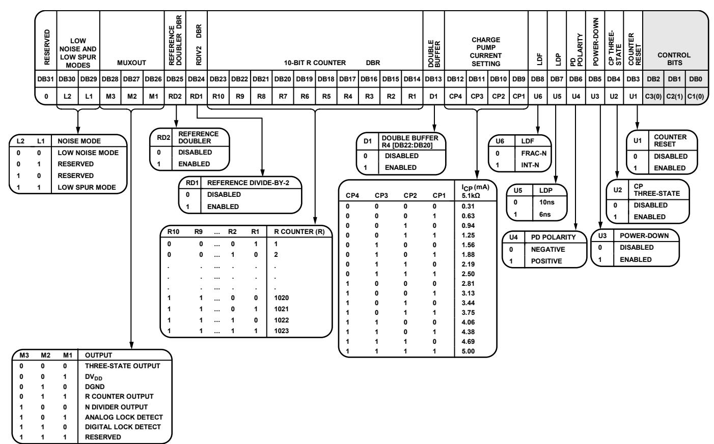

09800-014

*Figure 26. Register 2 (R2)*

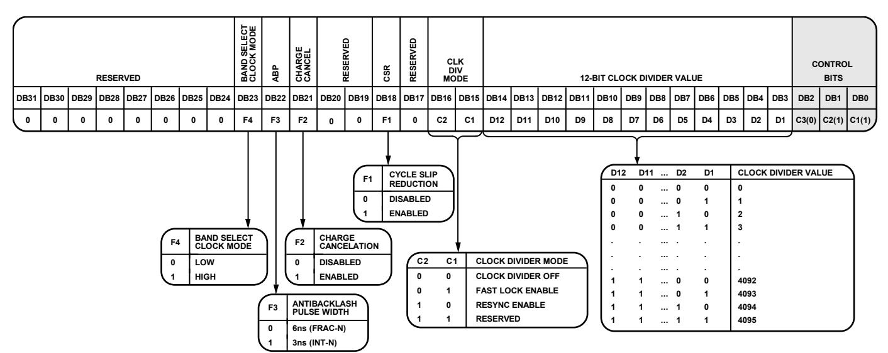

09800-015

*Figure 27. Register 3 (R3)*

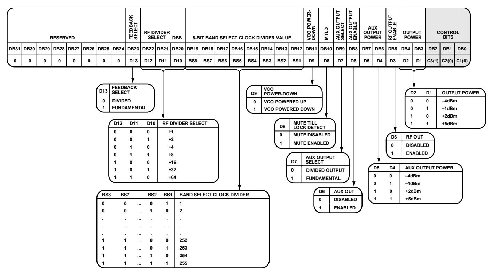

09800-016

*Figure 28. Register 4 (R4)*

| DB31 | DB30 | DB29 | DB28 | RESERVED DB27 | DB26 | DB25 | RESERVED RESERVED LD PIN MODE DB24 DB23 DB22 DB21 DB20 | DB19 | DB18 | DB17 | DB16 | DB15 | DB14 | DB13 | DB12 | DB11 | RESERVED DB10 | DB9 | DB8 | DB7 | DB6 | DB5 | DB4 | DB3 | DB2   | CONTROL BITS DB1 | DB0   |
|------|------|------|------|---------------|------|------|--------------------------------------------------------|------|------|------|------|------|------|------|------|------|---------------|-----|-----|-----|-----|-----|-----|-----|-------|------------------|-------|
| 0    | 0    | 0    | 0    | 0             | 0    | 0    | 0 D15 D14 0 1                                          | 1    | 0    | 0    | 0    | 0    | 0    | 0    | 0    | 0    | 0             | 0   | 0   | 0   | 0   | 0   | 0   | 0   | C3(1) | C2(0)            | C1(1) |
|      |      |      |      |               | D15  | D14  | LOCK DETECT PIN OPERATION                              |      |      |      |      |      |      |      |      |      |               |     |     |     |     |     |     |     |       |                  |       |
|      |      |      |      |               | 0    | 0    | LOW                                                    |      |      |      |      |      |      |      |      |      |               |     |     |     |     |     |     |     |       |                  |       |
|      |      |      |      |               | 0    | 1    | DIGITAL LOCK DETECT                                    |      |      |      |      |      |      |      |      |      |               |     |     |     |     |     |     |     |       |                  |       |
|      |      |      |      |               | 1    | 0    | LOW                                                    |      |      |      |      |      |      |      |      |      |               |     |     |     |     |     |     |     |       |                  |       |
|      |      |      |      |               | 1    | 1    | HIGH                                                   |      |      |      |      |      |      |      |      |      |               |     |     |     |     |     |     |     |       |                  |       |

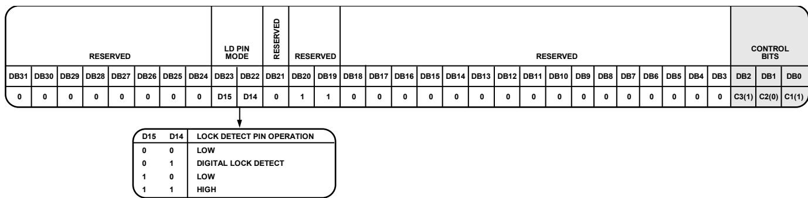

09800-017

*Figure 29. Register 5 (R5)*

#### **REGISTER 0**

#### *Control Bits*

When Bits[C3:C1] are set to 000, Register 0 is programmed. [Figure 24](#page-14-0) shows the input data format for programming this register.

#### *16-Bit Integer Value (INT)*

The 16 INT bits (Bits[DB30:DB15]) set the INT value, which determines the integer part of the feedback division factor. The INT value is used in Equation 1 (see th[e INT, FRAC, MOD,](#page-10-7) and [R Counter Relationship](#page-10-7) section). Integer values from 23 to 65,535 are allowed for the 4/5 prescaler; for the 8/9 prescaler, the minimum integer value is 75.

#### *12-Bit Fractional Value (FRAC)*

The 12 FRAC bits (Bits[DB14:DB3]) set the numerator of the fraction that is input to the Σ-Δ modulator. This fraction, along with the INT value, specifies the new frequency channel that the synthesizer locks to, as shown in the [RF Synthesizer—A](#page-20-0)  [Worked Example](#page-20-0) section. FRAC values from 0 to (MOD − 1) cover channels over a frequency range equal to the PFD reference frequency.

#### **REGISTER 1**

#### *Control Bits*

When Bits[C3:C1] are set to 001, Register 1 is programmed. [Figure 25](#page-14-1) shows the input data format for programming this register.

#### *Phase Adjust*

The phase adjust bit (Bit DB28) enables adjustment of the output phase of a given output frequency. When phase adjustment is enabled (Bit DB28 is set to 1), the part does not perform VCO band selection or phase resync when Register 0 is updated. When phase adjustment is disabled (Bit DB28 is set to 0), the part performs VCO band selection and phase resync (if phase resync is enabled in Register 3, Bits[DB16:DB15]) when Register 0 is updated. Disabling VCO band selection is recommended only for fixed frequency applications or for frequency deviations of <1 MHz from the originally selected frequency.

#### *Prescaler Value*

The dual-modulus prescaler (P/P + 1), along with the INT, FRAC, and MOD values, determines the overall division ratio from the VCO output to the PFD input. The PR1 bit (DB27) in Register 1 sets the prescaler value.

Operating at CML levels, the prescaler takes the clock from the VCO output and divides it down for the counters. The prescaler is based on a synchronous 4/5 core. When the prescaler is set to 4/5, the maximum RF frequency allowed is 3.6 GHz. Therefore, when operating the [ADF4351](http://www.analog.com/ADF4351) above 3.6 GHz, the prescaler must be set to 8/9. The prescaler limits the INT value as follows:

- Prescaler = 4/5: NMIN = 23
- Prescaler = 8/9: NMIN = 75

#### *12-Bit Phase Value*

Bits[DB26:DB15] control the phase word. The phase word must be less than the MOD value programmed in Register 1. The phase word is used to program the RF output phase from 0° to 360° with a resolution of 360°/MOD (see the [Phase Resync](#page-23-1) section).

In most applications, the phase relationship between the RF signal and the reference is not important. In such applications, the phase value can be used to optimize the fractional and subfractional spur levels. For more information, see the [Spur](#page-23-0)  [Consistency and Fractional Spur Optimization](#page-23-0) section.

If neither the phase resync nor the spurious optimization function is used, it is recommended that the phase word be set to 1.

#### *12-Bit Modulus Value (MOD)*

The 12 MOD bits (Bits[DB14:DB3]) set the fractional modulus. The fractional modulus is the ratio of the PFD frequency to the channel step resolution on the RF output. For more information, see the [12-Bit Programmable Modulus](#page-20-2) section.

#### **REGISTER 2**

#### *Control Bits*

When Bits[C3:C1] are set to 010, Register 2 is programmed. [Figure 26](#page-15-0) shows the input data format for programming this register.

#### *Low Noise and Low Spur Modes*

The noise mode on th[e ADF4351](http://www.analog.com/ADF4351) is controlled by setting Bits[DB30:DB29] in Register 2 (se[e Figure 26\)](#page-15-0). The noise mode allows the user to optimize a design either for improved spurious performance or for improved phase noise performance.

When the low spur mode is selected, dither is enabled. Dither randomizes the fractional quantization noise so that it resembles white noise rather than spurious noise. As a result, the part is optimized for improved spurious performance. Low spur mode is normally used for fast-locking applications when the PLL closed-loop bandwidth is wide. Wide loop bandwidth is a loop bandwidth greater than 1/10 of the RFOUT channel step resolution (fRES). A wide loop filter does not attenuate the spurs to the same level as a narrow loop bandwidth.

For best noise performance, use the low noise mode option. When the low noise mode is selected, dither is disabled. This mode ensures that the charge pump operates in an optimum region for noise performance. Low noise mode is extremely useful when a narrow loop filter bandwidth is available. The synthesizer ensures extremely low noise, and the filter attenuates the spurs. [Figure 10](#page-9-0) through [Figure 12](#page-9-1) show the trade-offs in a typical W-CDMA setup for different noise and spur settings.

#### *MUXOUT*

The on-chip multiplexer is controlled by Bits[DB28:DB26] (see [Figure 26\)](#page-15-0). Note that N counter output must be disabled for VCO band selection to operate correctly.

#### *Reference Doubler*

Setting the DB25 bit to 0 disables the doubler and feeds the REFIN signal directly into the 10-bit R counter. Setting this bit to 1 multiplies the REFIN frequency by a factor of 2 before feeding it into the 10-bit R counter. When the doubler is disabled, the REFIN falling edge is the active edge at the PFD input to the fractional synthesizer. When the doubler is enabled, both the rising and falling edges of REFIN become active edges at the PFD input.

When the doubler is enabled and the low spur mode is selected, the in-band phase noise performance is sensitive to the REFIN duty cycle. The phase noise degradation can be as much as 5 dB for REFIN duty cycles outside a 45% to 55% range. The phase noise is insensitive to the REFIN duty cycle in the low noise mode and when the doubler is disabled.

The maximum allowable REFIN frequency when the doubler is enabled is 30 MHz.

#### *RDIV2*

Setting the DB24 bit to 1 inserts a divide-by-2 toggle flip-flop between the R counter and the PFD, which extends the maximum REFIN input rate. This function allows a 50% duty cycle signal to appear at the PFD input, which is necessary for cycle slip reduction.

#### *10-Bit R Counter*

The 10-bit R counter (Bits[DB23:DB14]) allows the input reference frequency (REFIN) to be divided down to produce the reference clock to the PFD. Division ratios from 1 to 1023 are allowed.

#### *Double Buffer*

The DB13 bit enables or disables double buffering of Bits[DB22:DB20] in Register 4. For information about how double buffering works, see th[e Program Modes](#page-11-2) section.

#### *Charge Pump Current Setting*

Bits[DB12:DB9] set the charge pump current. This value should be set to the charge pump current that the loop filter is designed with (see [Figure 26\)](#page-15-0).

#### *Lock Detect Function (LDF)*

The DB8 bit configures the lock detect function (LDF). The LDF controls the number of PFD cycles monitored by the lock detect circuit to ascertain whether lock has been achieved. When DB8 is set to 0, the number of PFD cycles monitored is 40. When DB8 is set to 1, the number of PFD cycles monitored is 5. It is recommended that the DB8 bit be set to 0 for fractional-N mode and to 1 for integer-N mode.

#### *Lock Detect Precision (LDP)*

The lock detect precision bit (Bit DB7) sets the comparison window in the lock detect circuit. When DB7 is set to 0, the comparison window is 10 ns; when DB7 is set to 1, the window is 6 ns. The lock detect circuit goes high when n consecutive PFD cycles are less than the comparison window value; n is set by the LDF bit (DB8). For example, with DB8 = 0 and DB7 = 0, 40 consecutive PFD cycles of 10 ns or less must occur before digital lock detect goes high.

For fractional-N applications, the recommended setting for Bits[DB8:DB7] is 00; for integer-N applications, the recommended setting for Bits[DB8:DB7] is 11.

#### *Phase Detector Polarity*

The DB6 bit sets the phase detector polarity. When a passive loop filter or a noninverting active loop filter is used, this bit should be set to 1. If an active filter with an inverting characteristic is used, this bit should be set to 0.

#### *Power-Down (PD)*

The DB5 bit provides the programmable power-down mode. Setting this bit to 1 performs a power-down. Setting this bit to 0 returns the synthesizer to normal operation. In software powerdown mode, the part retains all information in its registers. The register contents are lost only if the supply voltages are removed.

When power-down is activated, the following events occur:

- Synthesizer counters are forced to their load state conditions.
- VCO is powered down.
- Charge pump is forced into three-state mode.
- Digital lock detect circuitry is reset.
- RFOUT buffers are disabled.
- Input registers remain active and capable of loading and latching data.

#### *Charge Pump Three-State*

Setting the DB4 bit to 1 puts the charge pump into three-state mode. This bit should be set to 0 for normal operation.

#### *Counter Reset*

The DB3 bit is the reset bit for the R counter and the N counter of the [ADF4351.](http://www.analog.com/ADF4351) When this bit is set to 1, the RF synthesizer N counter and R counter are held in reset. For normal operation, this bit should be set to 0.

#### **REGISTER 3**

#### *Control Bits*

When Bits[C3:C1] are set to 011, Register 3 is programmed. [Figure 27](#page-15-1) shows the input data format for programming this register.

#### *Band Select Clock Mode*

Setting the DB23 bit to 1 selects a faster logic sequence of band selection, which is suitable for high PFD frequencies and is necessary for fast lock applications. Setting the DB23 bit to 0 is recommended for low PFD (<125 kHz) values. For the faster band select logic modes (DB23 set to 1), the value of the band select clock divider must be less than or equal to 254.

#### *Antibacklash Pulse Width (ABP)*

Bit DB22 sets the PFD antibacklash pulse width. When Bit DB22 is set to 0, the PFD antibacklash pulse width is 6 ns. This setting is recommended for fractional-N use. When Bit DB22 is set to 1, the PFD antibacklash pulse width is 3 ns, which results in phase noise and spur improvements in integer-N operation. For fractional-N operation, the 3 ns setting is not recommended.

#### *Charge Cancelation*

Setting the DB21 bit to 1 enables charge pump charge cancelation. This has the effect of reducing PFD spurs in integer-N mode. In fractional-N mode, this bit should be set to 0.

#### *CSR Enable*

Setting the DB18 bit to 1 enables cycle slip reduction. CSR is a method for improving lock times. Note that the signal at the phase frequency detector (PFD) must have a 50% duty cycle for cycle slip reduction to work. The charge pump current setting must also be set to a minimum. For more information, see the [Cycle Slip Reduction for Faster Lock Times](#page-21-0) section.

#### *Clock Divider Mode*

Bits[DB16:DB15] must be set to 10 to activate phase resync (see th[e Phase Resync](#page-23-1) section). These bits must be set to 01 to activate fast lock (see the [Fast Lock Timer and Register](#page-21-2)  [Sequences](#page-21-2) section). Setting Bits[DB16:DB15] to 00 disables the clock divider (se[e Figure 27\)](#page-15-1).

#### *12-Bit Clock Divider Value*

Bits[DB14:DB3] set the 12-bit clock divider value. This value is the timeout counter for activation of phase resync (see the [Phase Resync](#page-23-1) section). The clock divider value also sets the timeout counter for fast lock (see th[e Fast Lock Timer and](#page-21-2)  [Register Sequences](#page-21-2) section).

### **REGISTER 4**

#### *Control Bits*

When Bits[C3:C1] are set to 100, Register 4 is programmed. [Figure 28](#page-16-1) shows the input data format for programming this register.

#### *Feedback Select*

The DB23 bit selects the feedback from the VCO output to the N counter. When this bit is set to 1, the signal is taken directly from the VCO. When this bit is set to 0, the signal is taken from the output of the output dividers. The dividers enable coverage of the wide frequency band (34.375 MHz to 4.4 GHz). When the dividers are enabled and the feedback signal is taken from the output, the RF output signals of two separately configured PLLs are in phase. This is useful in some applications where the positive interference of signals is required to increase the power.

#### *RF Divider Select*

Bits[DB22:DB20] select the value of the RF output divider (see [Figure 28\)](#page-16-1).

### *Band Select Clock Divider Value*

Bits[DB19:DB12] set a divider for the band select logic clock input. By default, the output of the R counter is the value used to clock the band select logic, but, if this value is too high (>125 kHz), a divider can be switched on to divide the R counter output to a smaller value (se[e Figure 28\)](#page-16-1).

#### *VCO Power-Down*

Setting the DB11 bit to 0 powers the VCO up; setting this bit to 1 powers the VCO down.

#### *Mute Till Lock Detect (MTLD)*

When the DB10 bit is set to 1, the supply current to the RF output stage is shut down until the part achieves lock, as measured by the digital lock detect circuitry.

#### *AUX Output Select*

The DB9 bit sets the auxiliary RF output. If DB9 is set to 0, the auxiliary RF output is the output of the RF dividers; if DB9 is set to 1, the auxiliary RF output is the fundamental VCO frequency.

#### *AUX Output Enable*

The DB8 bit enables or disables the auxiliary RF output. If DB8 is set to 0, the auxiliary RF output is disabled; if DB8 is set to 1, the auxiliary RF output is enabled.

#### *AUX Output Power*

Bits[DB7:DB6] set the value of the auxiliary RF output power level (se[e Figure 28\)](#page-16-1).

#### *RF Output Enable*

The DB5 bit enables or disables the primary RF output. If DB5 is set to 0, the primary RF output is disabled; if DB5 is set to 1, the primary RF output is enabled.

#### *Output Power*

Bits[DB4:DB3] set the value of the primary RF output power level (se[e Figure 28\)](#page-16-1).

#### **REGISTER 5**

#### *Control Bits*

When Bits[C3:C1] are set to 101, Register 5 is programmed. [Figure 29](#page-16-0) shows the input data format for programming this register.

#### *Lock Detect Pin Operation*

Bits[DB23:DB22] set the operation of the lock detect (LD) pin (see [Figure 29\)](#page-16-0).

#### **REGISTER INITIALIZATION SEQUENCE**

At initial power-up, after the correct application of voltages to the supply pins, th[e ADF4351](http://www.analog.com/ADF4351) registers should be started in the following sequence:

- 1. Register 5
- 2. Register 4
- 3. Register 3
- 4. Register 2
- 5. Register 1
- 6. Register 0

### **RF SYNTHESIZER—A WORKED EXAMPLE**

The following equations are used to program th[e ADF4351](http://www.analog.com/ADF4351) synthesizer:

| $RF_{OUT} = [INT + (FRAC/MOD)] \times (f_{FDF}/RF \text{ Divider})$ | (3) |
|---------------------------------------------------------------------|-----|
|---------------------------------------------------------------------|-----|

$$RF_{OUT} = [INT + (FRAC/MOD)] \times (f_{FPD}/RF \text{ Divider}) \quad (3)$$

where:

*RFOUT* is the RF frequency output.

*INT* is the integer division factor.

*FRAC* is the numerator of the fractional division (0 to MOD − 1). *MOD* is the preset fractional modulus (2 to 4095).

*RF Divider* is the output divider that divides down the VCO frequency.

$$f_{PFD} = REF_{IN} \times [(1 + D)/(R \times (1 + T))] \quad (4)$$

where:

*REFIN* is the reference frequency input.

*D* is the RF REFIN doubler bit (0 or 1).

*R* is the RF reference division factor (1 to 1023).

*T* is the reference divide-by-2 bit (0 or 1).

As an example, a UMTS system requires a 2112.6 MHz RF frequency output (RFOUT); a 10 MHz reference frequency input (REFIN) is available and a 200 kHz channel resolution (fRESOUT) is required on the RF output.

Note that the [ADF4351](http://www.analog.com/ADF4351) VCO operates in the frequency range of 2.2 GHz to 4.4 GHz. Therefore, the RF divider of 2 should be used (VCO frequency = 4225.2 MHz, RFOUT = VCO frequency/ RF divider = 4225.2 MHz/2 = 2112.6 MHz).

It is also important where the loop is closed. In this example, the loop is closed before the output divider (se[e Figure 30\)](#page-20-3).

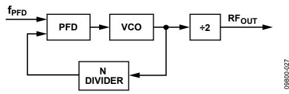

*Figure 30. Loop Closed Before Output Divider*

Channel resolution (fRESOUT) of 200 kHz is required at the output of the RF divider. Therefore, the channel resolution at the output of the VCO (fRES) needs to be 2 × fRESOUT, that is, 400 kHz.

*MOD* = *REFIN*/*fRES*

*MOD* = 10 MHz/400 kHz = 25

From Equation 4,

| $f_{PFD} = [10 \text{ MHz} \times (1 + 0)/1] = 10 \text{ MHz}$ | (5) |
|----------------------------------------------------------------|-----|
|----------------------------------------------------------------|-----|

| $f_{PFD} = [10 \text{ MHz} \times (1 + 0)/1] = 10 \text{ MHz}$ | (5) |
|----------------------------------------------------------------|-----|
|----------------------------------------------------------------|-----|

| 2112.6 MHz = 10 MHz $\times$ [( $INT + (FRAC/25)/2$ )] | (6) |
|--------------------------------------------------------|-----|
|--------------------------------------------------------|-----|

| 2112.6 MHz = 10 MHz $\times$ [(INT + (FRAC/25))/2] | (6) |
|----------------------------------------------------|-----|
|----------------------------------------------------|-----|

where:

*INT* = 422.

*FRAC* = 13.

### **REFERENCE DOUBLER AND REFERENCE DIVIDER**

The on-chip reference doubler allows the input reference signal to be doubled. Doubling the reference signal doubles the PFD comparison frequency, which improves the noise performance of the system. Doubling the PFD frequency usually improves noise performance by 3 dB. Note that in fractional-N mode, the PFD cannot operate above 32 MHz due to a limitation in the speed of the Σ-Δ circuit of the N divider. For integer-N applications, the PFD can operate up to 90 MHz.

The reference divide-by-2 divides the reference signal by 2, resulting in a 50% duty cycle PFD frequency. This is necessary for the correct operation of the cycle slip reduction (CSR) function. For more information, see th[e Cycle Slip Reduction](#page-21-0)  [for Faster Lock Times](#page-21-0) section.

## **12-BIT PROGRAMMABLE MODULUS**

The choice of modulus (MOD) depends on the reference signal (REFIN) available and the channel resolution (fRES) required at the RF output. For example, a GSM system with 13 MHz REFIN sets the modulus to 65. This means that the RF output resolution (fRES) is the 200 kHz (13 MHz/65) necessary for GSM. With dither off, the fractional spur interval depends on the selected modulus values (se[e Table 7\)](#page-22-2).

Unlike most other fractional-N PLLs, the [ADF4351](http://www.analog.com/ADF4351) allows the user to program the modulus over a 12-bit range. When combined with the reference doubler and the 10-bit R counter, the 12-bit modulus allows the user to set up the part in many different configurations for the application.

For example, consider an application that requires a 1.75 GHz RF frequency output with a 200 kHz channel step resolution. The system has a 13 MHz reference signal.

One possible setup is to feed the 13 MHz reference signal directly into the PFD and to program the modulus to divide by 65. This results in the required 200 kHz resolution.

Another possible setup is to use the reference doubler to create 26 MHz from the 13 MHz input signal. The 26 MHz is then fed into the PFD, and the modulus is programmed to divide by 130. This setup also results in 200 kHz resolution but offers superior phase noise performance over the first setup.

The programmable modulus is also very useful for multistandard applications. For example, if a dual-mode phone requires PDC and GSM 1800 standards, the programmable modulus is of great benefit.

PDC requires 25 kHz channel step resolution, whereas GSM 1800 requires 200 kHz channel step resolution. A 13 MHz reference signal can be fed directly to the PFD, and the modulus can be programmed to 520 when in PDC mode (13 MHz/520 = 25 kHz). The modulus must be reprogrammed to 65 for GSM 1800 operation (13 MHz/65 = 200 kHz).

It is important that the PFD frequency remain constant (in this example, 13 MHz). This allows the user to design one loop filter for both setups without encountering stability issues. Note that the ratio of the RF frequency to the PFD frequency principally affects the loop filter design, not the actual channel spacing.

### **CYCLE SLIP REDUCTION FOR FASTER LOCK TIMES**

As described in the [Low Noise and Low Spur Modes](#page-17-3) section, the [ADF4351](http://www.analog.com/ADF4351) contains a number of features that allow optimization for noise performance. However, in fast-locking applications, the loop bandwidth generally needs to be wide and, therefore, the filter does not provide much attenuation of the spurs. If the cycle slip reduction feature is enabled, the narrow loop bandwidth is maintained for spur attenuation, but faster lock times are still possible.

#### *Cycle Slips*

Cycle slips occur in integer-N/fractional-N synthesizers when the loop bandwidth is narrow compared to the PFD frequency. The phase error at the PFD inputs accumulates too fast for the PLL to correct, and the charge pump temporarily pumps in the wrong direction. This slows down the lock time dramatically. The [ADF4351](http://www.analog.com/ADF4351) contains a cycle slip reduction feature that extends the linear range of the PFD, allowing faster lock times without modifications to the loop filter circuitry.

When the circuitry detects that a cycle slip is about to occur, it turns on an extra charge pump current cell. This cell outputs a constant current to the loop filter or removes a constant current from the loop filter (depending on whether the VCO tuning voltage needs to increase or decrease to acquire the new frequency). The effect is that the linear range of the PFD is increased. Loop stability is maintained because the current is constant and is not a pulsed current.

If the phase error increases again to a point where another cycle slip is likely, th[e ADF4351](http://www.analog.com/ADF4351) turns on another charge pump cell. This continues until th[e ADF4351](http://www.analog.com/ADF4351) detects that the VCO frequency has exceeded the desired frequency. The extra charge pump cells are turned off one by one until all the extra charge pump cells are disabled and the frequency settles to the original loop filter bandwidth.

Up to seven extra charge pump cells can be turned on. In most applications, seven cells are enough to eliminate cycle slips altogether, providing much faster lock times.

Setting Bit DB18 in Register 3 to 1 enables cycle slip reduction. Note that the PFD requires a 45% to 55% duty cycle for CSR to operate correctly. If the REFIN frequency does not have a suitable duty cycle, enabling the RDIV2 mode (Bit DB24 in Register 2) ensures that the input to the PFD has a 50% duty cycle.

### **SPURIOUS OPTIMIZATION AND FAST LOCK**

Narrow loop bandwidths can filter unwanted spurious signals, but these bandwidths usually have a long lock time. A wider loop bandwidth achieves faster lock times but may lead to increased spurious signals inside the loop bandwidth.

The fast lock feature can achieve the same fast lock time as the wider bandwidth but with the advantage of a narrow final loop bandwidth to keep spurs low.

## **FAST LOCK TIMER AND REGISTER SEQUENCES**

If the fast lock mode is used, a timer value must be loaded into the PLL to determine the duration of the wide bandwidth mode.

When Bits[DB16:DB15] in Register 3 are set to 01 (fast lock enable), the timer value is loaded by the 12-bit clock divider value (Bits[DB14:DB3] in Register 3). The following sequence must be programmed to use fast lock:

- 1. Start the initialization sequence (see th[e Register Initialization](#page-19-2)  [Sequence](#page-19-2) section). This sequence occurs only once after powering up the part.
- 2. Load Register 3 by setting Bits[DB16:DB15] to 01 and by setting the selected fast lock timer value (Bits[DB14:DB3]). The duration that the PLL remains in wide bandwidth mode is equal to the fast lock timer/fPFD.

#### **FAST LOCK EXAMPLE**

If a PLL has a reference frequency of 13 MHz, fPFD of 13 MHz, and a required lock time of 60 µs, the PLL is set to wide bandwidth mode for 20 µs. This example assumes a modulus of 65 for channel spacing of 200 kHz. The VCO calibration time of 20 µs must also be taken into account (achieved by programming the higher band select clock mode using Bit DB23 of Register 3).

If the time set for the PLL lock time in wide bandwidth mode is 20 µs, then

*Fast Lock Timer Value* = (*VCO Band Select Time* + *PLL Lock Time in Wide Bandwidth*) × *fPFD*/*MOD*

*Fast Lock Timer Value* = (20 µs + 20 µs) × 13 MHz/65 = 8

Therefore, a value of 8 must be loaded into the clock divider value in Register 3 (see Step 2 in the [Fast Lock Timer and](#page-21-2)  [Register Sequences](#page-21-2) section).

### **FAST LOCK LOOP FILTER TOPOLOGY**

To use fast lock mode, the damping resistor in the loop filter is reduced to one-fourth its value while in wide bandwidth mode. To achieve the wider loop filter bandwidth, the charge pump current increases by a factor of 16; to maintain loop stability, the damping resistor must be reduced by a factor of one-fourth. To enable fast lock, the SW pin is shorted to the AGND pin by setting Bits[DB16:DB15] in Register 3 to 01. The following two topologies are available:

 The damping resistor (R1) is divided into two values (R1 and R1A) that have a ratio of 1:3 (see [Figure 31\)](#page-22-3). An extra resistor (R1A) is connected directly from SW, as shown in [Figure 32.](#page-22-4) The extra resistor is calculated such that the parallel combination of the extra resistor and the damping resistor (R1) is reduced to one-fourth the original value of R1 (se[e Figure 32\)](#page-22-4).

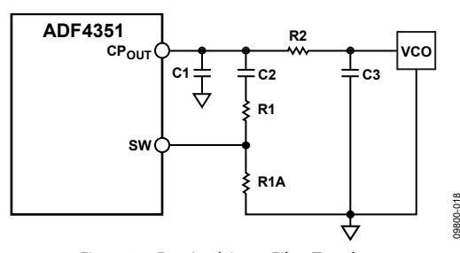

Figure 31. Fast Lock Loop Filter Topology 1

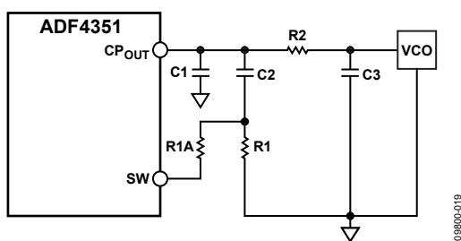

Figure 32. Fast Lock Loop Filter Topology 2

#### **SPUR MECHANISMS**

This section describes the three different spur mechanisms that arise with a fractional-N synthesizer and how to minimize them in the [ADF4351.](http://www.analog.com/ADF4351) 

#### **Fractional Spurs**

The fractional interpolator in th[e ADF4351 i](http://www.analog.com/ADF4351)s a third-order Σ-Δ modulator with a modulus (MOD) that is programmable to any integer value from 2 to 4095. In low spur mode (dither on), the minimum allowable value of MOD is 50. The Σ-Δ modulator is clocked at the PFD reference rate (fPFD), which allows PLL output frequencies to be synthesized at a channel step resolution of fPFD/MOD.

In low noise mode (dither off), the quantization noise from the Σ-Δ modulator appears as fractional spurs. The interval between spurs is fPFD/L, where L is the repeat length of the code sequence in the digital Σ-Δ modulator. For the third-order Σ-Δ modulator used in the [ADF4351,](http://www.analog.com/ADF4351) the repeat length depends on the value of MOD (see Table 7).

**Table 7. Fractional Spurs with Dither Off (Low Noise Mode)** 

| MOD Value (Dither Off)              | Repeat  |                |
|-------------------------------------|---------|----------------|
|                                     | Length  | Spur Interval  |
| MOD is divisible by 2, but not by 3 | 2 × MOD | Channel step/2 |
| MOD is divisible by 3, but not by 2 | 3 × MOD | Channel step/3 |
| MOD is divisible by 6               | 6 × MOD | Channel step/6 |
| MOD is not divisible by 2, 3, or 6  | MOD     | Channel step   |

In low spur mode (dither on), the repeat length is extended to 221 cycles, regardless of the value of MOD, which makes the quantization error spectrum look like broadband noise. This may degrade the in-band phase noise at the PLL output by as much as 10 dB. For lowest noise, dither off is a better choice, particularly when the final loop bandwidth is low enough to attenuate even the lowest frequency fractional spur.

#### **Integer Boundary Spurs**

Another mechanism for fractional spur creation is the interactions between the RF VCO frequency and the reference frequency. When these frequencies are not integer related (the purpose of a fractional-N synthesizer), spur sidebands appear on the VCO output spectrum at an offset frequency that corresponds to the beat note, or difference frequency, between an integer multiple of the reference and the VCO frequency. These spurs are attenuated by the loop filter and are more noticeable on channels close to integer multiples of the reference, where the difference frequency can be inside the loop bandwidth (thus the name integer boundary spurs).

#### **Reference Spurs**

Reference spurs are generally not a problem in fractional-N synthesizers because the reference offset is far outside the loop bandwidth. However, any reference feedthrough mechanism that bypasses the loop may cause a problem. Feedthrough of low levels of on-chip reference switching noise, coupling to the VCO, can result in reference spur levels as high as −80 dBc. The PCB layout must ensure adequate isolation between VCO circuitry and the input reference to avoid a possible feedthrough path on the board.

#### **SPUR CONSISTENCY AND FRACTIONAL SPUR OPTIMIZATION**

With dither off, the fractional spur pattern due to the quantization noise of the Σ-Δ modulator also depends on the particular phase word with which the modulator is seeded.

The phase word can be varied to optimize the fractional and subfractional spur levels on any particular frequency. Thus, a lookup table of phase values corresponding to each frequency can be created for use when programming th[e ADF4351.](http://www.analog.com/ADF4351)

If a lookup table is not used, keep the phase word at a constant value to ensure consistent spur levels on any particular frequency.

### **PHASE RESYNC**

The output of a fractional-N PLL can settle to any one of the MOD phase offsets with respect to the input reference, where MOD is the fractional modulus. The phase resync feature of the [ADF4351](http://www.analog.com/ADF4351) produces a consistent output phase offset with respect to the input reference. This phase offset is necessary in applications where the output phase and frequency are important, such as digital beamforming. See the Phase [Programmability](#page-23-2) section to program a specific RF output phase when using phase resync.

Phase resync is enabled by setting Bits[DB16:DB15] in Register 3 to 10. When phase resync is enabled, an internal timer generates sync signals at intervals of tSYNC given by the following formula:

$$t_{\text{SYNC}} = \text{CLK\_DIV\_VALUE} \times \text{MOD} \times t_{\text{PFD}}$$

$$t_{SYNC} = CLK_{DIV}_{VALUE} \times MOD \times t_{PFD}$$

where:

*CLK\_DIV\_VALUE* is the decimal value programmed in Bits[DB14:DB3] of Register 3. This value can be any integer from 1 to 4095.

*MOD* is the modulus value programmed in Bits[DB14:DB3] of Register 1 (R1).

*tPFD* is the PFD reference period.

When a new frequency is programmed, the second sync pulse after the LE rising edge is used to resynchronize the output phase to the reference. The tSYNC time must be programmed to a value that is at least as long as the worst-case lock time. This guarantees that the phase resync occurs after the last cycle slip in the PLL settling transient.

In the example shown in [Figure 33,](#page-23-3) the PFD reference is 25 MHz and MOD = 125 for a 200 kHz channel spacing. tSYNC is set to 400 µs by programming CLK\_DIV\_VALUE = 80.

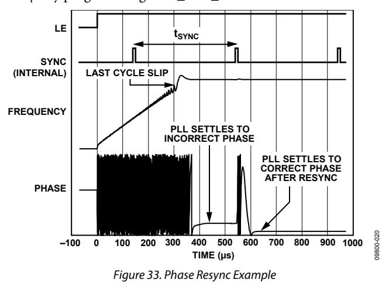

#### *Phase Programmability*

The phase word in Register 1 controls the RF output phase. As this word is swept from 0 to MOD, the RF output phase sweeps over a 360° range in steps of 360°/MOD. In many applications, it is advisable to disable VCO band selection by setting Bit DB28 in Register 1 (R1) to 1. This setting selects the phase adjust feature.

#### *High PFD Frequencies*

VCO band selection is required to ensure that the correct VCO band is chosen for the relevant frequency. VCO band selection can operate with PFD frequencies up to 45 MHz using the high VCO band select mode (set Bit DB23 in Register 3 to 1).

For PFD frequencies higher than 45 MHz, it is recommended that the user perform the following steps:

- 1. Program the desired VCO frequency with phase adjustment disabled (set Bit DB28 in Register 1 to 0). Ensure that the PFD frequency is less than 45 MHz.
- 2. After the correct frequency is achieved, enable phase adjustment (set Bit DB28 in Register 1 to 1).
- 3. PFD frequencies higher than 32 MHz are permissible only with integer-N applications; therefore, set the antibacklash pulse width to 3 ns (set Bit DB22 in Register 3 to 1).
- 4. Using the desired PFD frequency, program the appropriate values for the reference R and feedback N counters.

Using this procedure, the lowest rms in-band phase noise can be achieved.

## APPLICATIONS INFORMATION **DIRECT CONVERSION MODULATOR**

Direct conversion architectures are increasingly being used to implement base station transmitters[. Figure 34](#page-24-2) shows how Analog Devices, Inc., parts can be used to implement such a system.

[Figure 34](#page-24-2) shows th[e AD9788](http://www.analog.com/AD9788) TxDAC® used with the [ADL5375.](http://www.analog.com/ADL5375) The use of dual integrated DACs, such as th[e AD9788](http://www.analog.com/AD9788) with its specified ±2% FSR and ±0.001% FSR gain and offset characteristics, ensures minimum error contribution (over temperature) from this portion of the signal chain.

The local oscillator (LO) is implemented using th[e ADF4351.](http://www.analog.com/ADF4351) The low-pass filter was designed usin[g ADIsimPLL™](http://www.analog.com/ADIsimPLL) for a channel spacing of 200 kHz and a closed-loop bandwidth of 35 kHz.

The LO ports of the [ADL5375](http://www.analog.com/ADL5375) can be driven differentially from the complementary RFOUTA± outputs of th[e ADF4351.](http://www.analog.com/ADF4351) This setup provides better performance than a single-ended LO driver and eliminates the use of a balun to convert from a single-ended LO input to the more desirable differential LO input for th[e ADL5375.](http://www.analog.com/ADL5375) The typical rms phase noise (100 Hz to 5 MHz) of the LO in this configuration is 0.61° rms.

The [ADL5375](http://www.analog.com/ADL5375) accepts LO drive levels from −6 dBm to +6 dBm. The optimum LO power can be software programmed on the [ADF4351,](http://www.analog.com/ADF4351) which allows levels from −4 dBm to +5 dBm from each output.

The RF output is designed to drive a 50 Ω load, but it must be ac-coupled, as shown i[n Figure 34.](#page-24-2) If the I and Q inputs are driven in quadrature by 2 V p-p signals, the resulting output power from the [ADL5375](http://www.analog.com/ADL5375) modulator is approximately 2 dBm.

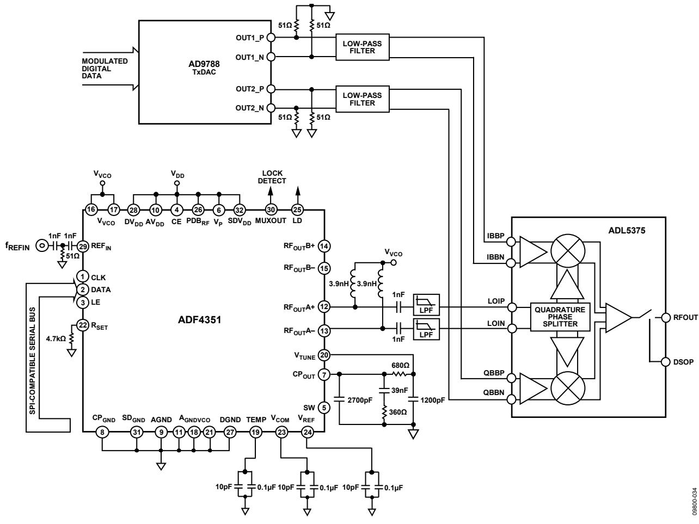

*Figure 34. Direct Conversion Modulator*

#### **INTERFACING TO THE [ADuC70xx A](http://www.analog.com/ADuC70)ND TH[E ADSP-BF527](http://www.analog.com/ADSP-BF527)**

The [ADF4351 h](http://www.analog.com/ADF4351)as a simple SPI-compatible serial interface for writing to the device. The CLK, DATA, and LE pins control the data transfer. When LE goes high, the 32 bits that were clocked into the appropriate register on each rising edge of CLK are transferred to the appropriate latch. Se[e Figure 2 f](#page-4-1)or the timing diagram and [Table 6](#page-11-5) for the register address table.

#### **ADuC70xx Interface**

[Figure 35 s](#page-25-2)hows the interface between th[e ADF4351](http://www.analog.com/ADF4351) and the [ADuC70xx](http://www.analog.com/ADuC70) family of analog microcontrollers. The [ADuC70xx](http://www.analog.com/ADuC70) family is based on an AMR7 core, but the same interface can be used with any 8051-based microcontroller.

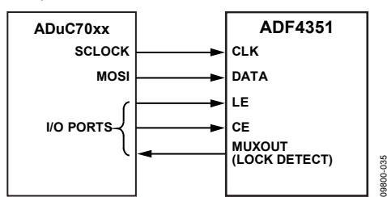

Figure 35[. ADuC70xx t](http://www.analog.com/ADuC70)[o ADF4351 I](http://www.analog.com/ADF4351)nterface

The microcontroller is set up for SPI master mode with CPHA = 0. To initiate the operation, the I/O port driving LE is brought low. Each latch of th[e ADF4351](http://www.analog.com/ADF4351) needs a 32-bit word, which is accomplished by writing four 8-bit bytes from the microcontroller to the device. After the fourth byte is written, the LE input should be brought high to complete the transfer.

When power is first applied to the [ADF4351,](http://www.analog.com/ADF4351) the part requires six writes (one each to R5, R4, R3, R2, R1, and R0) for the output to become active.

I/O port lines on the microcontroller are also used to control the power-down input (CE) and to detect lock (MUXOUT configured as lock detect and polled by the port input).

When operating in the mode described, the maximum SPI transfer rate of the [ADuC70xx](http://www.analog.com/ADuC70) is 20 Mbps. This means that the maximum rate at which the output frequency can be changed is 833 kHz. If using a faster SPI clock, make sure that the SPI timing requirements listed i[n Table 2 a](#page-4-2)re adhered to.

#### **[ADSP-BF527 I](http://www.analog.com/ADSP-BF527)nterface**

[Figure 36 s](#page-25-3)hows the interface between th[e ADF4351](http://www.analog.com/ADF4351) and the Blackfin[® ADSP-BF527](http://www.analog.com/ADSP-BF527) digital signal processor (DSP). The [ADF4351 n](http://www.analog.com/ADF4351)eeds a 32-bit serial word for each latch write. The easiest way to accomplish this using the Blackfin family is to use the autobuffered transmit mode of operation with alternate framing. This mode provides a means for transmitting an entire block of serial data before an interrupt is generated.

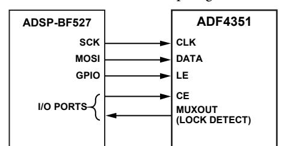

Figure 36[. ADSP-BF527 t](http://www.analog.com/ADSP-BF527)[o ADF4351 I](http://www.analog.com/ADF4351)nterface

Set up the word length for eight bits and use four memory locations for each 32-bit word. To program each 32-bit latch, store the four 8-bit bytes, enable the autobuffered mode, and write to the transmit register of the DSP. This last operation initiates the autobuffer transfer. Make sure that the SPI timing requirements listed in [Table 2](#page-4-2) are adhered to.

#### **PCB DESIGN GUIDELINES FOR A CHIP SCALE PACKAGE**

The lands on the chip scale package (CP-32-7) are rectangular. The PCB pad for these lands must be 0.1 mm longer than the package land length and 0.05 mm wider than the package land width. Each land must be centered on the pad to ensure that the solder joint size is maximized.

The bottom of the chip scale package has a central exposed thermal pad. The thermal pad on the PCB must be at least as large as the exposed pad. On the PCB, there must be a minimum clearance of 0.25 mm between the thermal pad and the inner edges of the pad pattern to ensure that shorting is avoided.

Thermal vias can be used on the PCB thermal pad to improve the thermal performance of the package. If vias are used, they must be incorporated into the thermal pad at 1.2 mm pitch grid. The via diameter must be between 0.3 mm and 0.33 mm, and the via barrel must be plated with 1 oz. of copper to plug the via.

### **OUTPUT MATCHING**

For optimum operation, the output of th[e ADF4351](http://www.analog.com/ADF4351) can be matched in a number of ways; the most basic method is to connect a 50 Ω resistor to VVCO. A dc bypass capacitor of 100 pF is connected in series, as shown i[n Figure 37.](#page-26-1) Because the resistor is not frequency dependent, this method provides a good broadband match. When connected to a 50 Ω load, this circuit typically gives a differential output power equal to the value selected by Bits[DB4:DB3] in Register 4 (R4).

Figure 37. Simple Output Stage

A better solution is to use a shunt inductor (acting as an RF choke) to VVCO. This solution gives a better match and, therefore, more output power.

Experiments have shown that the circuit shown in [Figure 38](#page-26-2) provides an excellent match to 50 Ω for the W-CDMA UMTS Band 1 (2110 MHz to 2170 MHz). The maximum output power in this case is approximately 5 dBm. Both single-ended architectures can be examined using the EVAL-ADF4351EB1Z evaluation board.

If differential outputs are not needed, the unused output can be terminated, or both outputs can be combined using a balun.

A balun using discrete inductors and capacitors can be implemented with the architecture shown i[n Figure 39.](#page-26-3) The LC balun comprises Component L1 and Component C1. L2 provides a dc path for RFOUTA−, and Capacitor C2 is used for dc blocking.

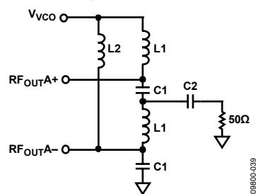